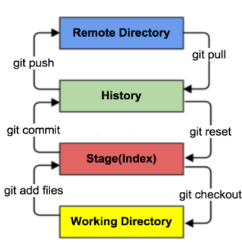
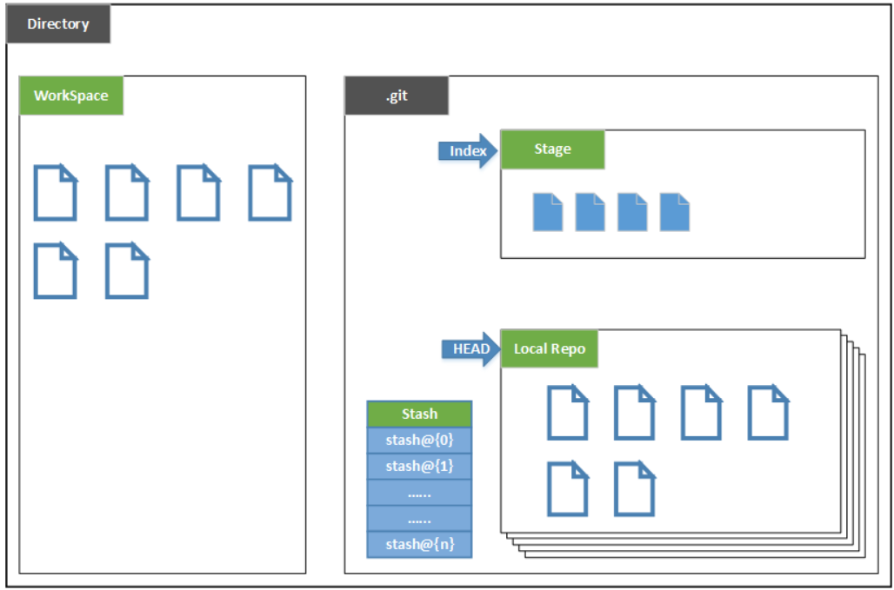

# Development assistance

# Maven高级应用

## 1. Maven基础回顾

1. maven是一个管理工具
2. 依赖管理：maven对项目中jar包的管理过程。传统工程我们直接把jar包放置在项目中。
    1. 仓库种类：本地仓库，远程仓库（私服），中央仓库
    2. 仓库之间的关系：当我们启动一个maven工程时，maven工程会通过pom文件中的jar包坐标去找对应jar包。默认情况下，如果本地仓库没有对应jar包，maven工程会自动去中央仓库下载jar包到本地仓库（公司中是私服）。如果都没有可以本地上传。
3. 一键构建：maven自身集成了tomcat插件，可以对项目进行编译，测试，打包，安装，发布等操作。
    1. maven常用命令：clean，compile（编译），test，package，install，deploy

## 2. Maven工程拆分与聚合的思想

1. 基于上边的三个工程分析

    1. 继承：创建一个 parent 工程将所需的依赖都配置在 pom 中 
    2. 聚合：聚合多个模块运行。

2. 需求描述

    1. 将 SSM 工程拆分为多个模块开发：

    

3.  理解继承和聚合 通常继承和聚合同时使用。

    1. 何为继承？

        继承是为了消除重复，如果将 dao、service、web 分开创建独立的工程则每个工程的 pom.xml 文件中的内容存在重复，比如：设置编译版本、锁定 spring 的版本的等，可以将这些重复的 配置提取出来在父工程的 pom.xml  中定义。

    2.  何为聚合？ 

        项目开发通常是分组分模块开发，每个模块开发完成要运行整个工程需要将每个模块聚合在 一起运行，比如：dao、service、web  三个工程最终会打一个独立的 war  运行。

## 3. 搭建远程仓库(了解)

[Maven](file:///C:\Mr.Gao\学习笔记\Development assistance\Maven.docx)


## 4. 如何安装第三方jar包

1. 导入命令

    mvn install:install-file -DgroupId=com.alibaba -DartifactId=fastjson -Dversion=1.1.37 -Dfile= fastjson-1.1.37.jar  -Dpackaging=jar
    
    

----

# Git

## 1. 版本控制

> **版本控制概念**

版本控制（Revision control）是一种在开发的过程中用于管理我们对文件、目录或工程等内容的修改历史，方便查看更改历史记录，备份以便恢复以前的版本的软件工程技术。

* 实现跨区域多人协同开发
* 追踪和记载一个或者多个文件的历史记录
* 组织和保护你的源代码和文档
* 统计工作量
* 并行开发、提高开发效率
* 跟踪记录整个软件的开发过程
* 减轻开发人员的负担，节省时间，同时降低人为错误

简单说就是用于管理多人协同开发项目的技术。

没有进行版本控制或者版本控制本身缺乏正确的流程管理，在软件开发过程中将会引入很多问题，如软件代码的一致性、软件内容的冗余、软件过程的事物性、软件开发过程中的并发性、软件源代码的安全性，以及软件的整合等问题。

无论是工作还是学习，或者是自己做笔记，都经历过这样一个阶段！我们就迫切需要一个版本控制工具！

> **常见的版本控制工具**

我们学习的东西，一定是当下最流行的！

主流的版本控制器有如下这些：

- **Git**
- **SVN**（Subversion）
- **CVS**（Concurrent Versions System）
- **VSS**（Micorosoft Visual SourceSafe）
- **TFS**（Team Foundation Server）
- Visual Studio Online

版本控制产品非常的多（Perforce、Rational ClearCase、RCS（GNU Revision Control System）、Serena Dimention、SVK、BitKeeper、Monotone、Bazaar、Mercurial、SourceGear Vault），现在影响力最大且使用最广泛的是Git与SVN

> **版本控制分类**

**1、本地版本控制**

记录文件每次的更新，可以对每个版本做一个快照，或是记录补丁文件，适合个人用，如RCS。


**2、集中版本控制  SVN**

所有的版本数据都保存在服务器上，协同开发者从服务器上同步更新或上传自己的修改


所有的版本数据都存在服务器上，用户的本地只有自己以前所同步的版本，如果不连网的话，用户就看不到历史版本，也无法切换版本验证问题，或在不同分支工作。而且，所有数据都保存在单一的服务器上，有很大的风险这个服务器会损坏，这样就会丢失所有的数据，当然可以定期备份。代表产品：SVN、CVS、VSS

**3、分布式版本控制 	Git**

每个人都拥有全部的代码！安全隐患！

所有版本信息仓库全部同步到本地的每个用户，这样就可以在本地查看所有版本历史，可以离线在本地提交，只需在连网时push到相应的服务器或其他用户那里。由于每个用户那里保存的都是所有的版本数据，只要有一个用户的设备没有问题就可以恢复所有的数据，但这增加了本地存储空间的占用。

不会因为服务器损坏或者网络问题，造成不能工作的情况！


> **Git与SVN的主要区别**

SVN是集中式版本控制系统，版本库是集中放在中央服务器的，而工作的时候，用的都是自己的电脑，所以首先要从中央服务器得到最新的版本，然后工作，完成工作后，需要把自己做完的活推送到中央服务器。集中式版本控制系统是必须联网才能工作，对网络带宽要求较高。


Git是分布式版本控制系统，没有中央服务器，每个人的电脑就是一个完整的版本库，工作的时候不需要联网了，因为版本都在自己电脑上。协同的方法是这样的：比如说自己在电脑上改了文件A，其他人也在电脑上改了文件A，这时，你们两之间只需把各自的修改推送给对方，就可以互相看到对方的修改了。Git可以直接看到更新了哪些代码和文件！

**Git是目前世界上最先进的分布式版本控制系统。**


## 2 Git的历史

**Git是目前世界上最先进的分布式版本控制系统。**

Git是免费、开源的，最初Git是为辅助 Linux 内核开发的，来替代 BitKeeper！


Linux和Git之父**李纳斯·托沃兹**（Linus Benedic Torvalds）1969、芬兰

## 3. Git环境配置

> **软件下载**

打开 [git官网](https://git-scm.com/)，下载git对应操作系统的版本。

所有东西下载慢的话就可以去找镜像！

淘宝镜像下载：http://npm.taobao.org/mirrors/git-for-windows/

> **启动Git**

**Git Bash：**Unix与Linux风格的命令行，使用最多，推荐最多

**Git CMD：**Windows风格的命令行

**Git GUI**：图形界面的Git，不建议初学者使用，尽量先熟悉常用命令

> **常用的Linux命令**

平时一定要多使用这些基础的命令！

1. cd : 改变目录。

2. cd . . 回退到上一个目录，直接cd进入默认目录

3. pwd : 显示当前所在的目录路径。

4. ls(ll):  都是列出当前目录中的所有文件，只不过ll(两个ll)列出的内容更为详细。

5. touch : 新建一个文件 如 touch index.js 就会在当前目录下新建一个index.js文件。

6. rm:  删除一个文件, rm index.js 就会把index.js文件删除。

7. mkdir:  新建一个目录,就是新建一个文件夹。

8. rm -r :  删除一个文件夹, rm -r src 删除src目录

```shell
rm -rf / 切勿在Linux中尝试！删除电脑中全部文件！
```

9. mv 移动文件, mv index.html src index.html 是我们要移动的文件, src 是目标文件夹,当然, 这样写,必须保证文件和目标文件夹在同一目录下。
10.  reset 重新初始化终端/清屏。

11. clear 清屏。

12. history 查看命令历史。

13. help 帮助。

14. exit 退出。

15. #表示注释

> **Git配置**

所有的配置文件，其实都保存在本地！

查看配置 git config -l

查看不同级别的配置文件：

```shell
#查看系统config
git config --system --list　　
#查看当前用户（global）配置
git config --global  --list
```

**Git相关的配置文件：**

1. Git\etc\gitconfig  ：Git 安装目录下的 gitconfig   --system 系统级

2. C:\Users\Administrator\ .gitconfig   只适用于当前登录用户的配置  --global 全局


> **设置用户名与邮箱**（用户标识，必要）

当你安装Git后首先要做的事情是设置你的用户名称和e-mail地址。这是非常重要的，因为每次Git提交都会使用该信息。它被永远的嵌入到了你的提交中：

```
git config --global user.name "kuangshen"  
#名称
git config --global user.email 24736743@qq.com   
#邮箱
```

只需要做一次这个设置，如果你传递了--global 选项，因为Git将总是会使用该信息来处理你在系统中所做的一切操作。如果你希望在一个特定的项目中使用不同的名称或e-mail地址，你可以在该项目中运行该命令而不要--global选项。总之--global为全局配置，不加为某个项目的特定配置。


## 4. Git基本理论（重要）

> **三个区域**

Git本地有三个工作区域：工作目录（Working Directory）、暂存区(Stage/Index)、资源库(Repository或Git Directory)。如果在加上远程的git仓库(Remote Directory)就可以分为四个工作区域。文件在这四个区域之间的转换关系如下：



- Workspace：工作区，就是你平时存放项目代码的地方
- Index / Stage：暂存区，用于临时存放你的改动，事实上它只是一个文件，保存即将提交到文件列表信息
- Repository：仓库区（或本地仓库），就是安全存放数据的位置，这里面有你提交到所有版本的数据。其中HEAD指向最新放入仓库的版本
- Remote：远程仓库，托管代码的服务器，可以简单的认为是你项目组中的一台电脑用于远程数据交换

本地的三个区域确切的说应该是git仓库中HEAD指向的版本：



- Directory：使用Git管理的一个目录，也就是一个仓库，包含我们的工作空间和Git的管理空间。
- WorkSpace：需要通过Git进行版本控制的目录和文件，这些目录和文件组成了工作空间。
- .git：存放Git管理信息的目录，初始化仓库的时候自动创建。
- Index/Stage：暂存区，或者叫待提交更新区，在提交进入repo之前，我们可以把所有的更新放在暂存区。
- Local Repo：本地仓库，一个存放在本地的版本库；HEAD会只是当前的开发分支（branch）。
- Stash：隐藏，是一个工作状态保存栈，用于保存/恢复WorkSpace中的临时状态。

> **工作流程**

git的工作流程一般是这样的：

１、在工作目录中添加、修改文件；

２、将需要进行版本管理的文件放入暂存区域；

３、将暂存区域的文件提交到git仓库。

因此，git管理的文件有三种状态：已修改（modified）,已暂存（staged）,已提交(committed)


## 5. Git项目搭建

> **创建工作目录与常用指令**

工作目录（WorkSpace)一般就是你希望Git帮助你管理的文件夹，可以是你项目的目录，也可以是一个空目录，建议不要有中文。

日常使用只要记住下图6个命令：


> **本地仓库搭建**

创建本地仓库的方法有两种：一种是创建全新的仓库，另一种是克隆远程仓库。

1、创建全新的仓库，需要用GIT管理的项目的根目录执行：

```shell
# 在当前目录新建一个Git代码库
git init
```

2、执行后可以看到，仅仅在项目目录多出了一个.git目录，关于版本等的所有信息都在这个目录里面。

> **克隆远程仓库**

1、另一种方式是克隆远程目录，由于是将远程服务器上的仓库完全镜像一份至本地！

```shell
# 克隆一个项目和它的整个代码历史(版本信息)
git clone [url]  # https://gitee.com/kuangstudy/openclass.git
```

2、去 gitee 或者 github 上克隆一个测试！


## 6. Git文件操作

> **文件的四种状态**

版本控制就是对文件的版本控制，要对文件进行修改、提交等操作，首先要知道文件当前在什么状态，不然可能会提交了现在还不想提交的文件，或者要提交的文件没提交上。

- **Untracked**: 未跟踪, 此文件在文件夹中, 但并没有加入到git库, 不参与版本控制. 通过`git add` 状态变为`Staged`.
- **Unmodify**: 文件已经入库, 未修改, 即版本库中的文件快照内容与文件夹中完全一致. 这种类型的文件有两种去处, 如果它被修改, 而变为`Modified`. 如果使用`git rm`移出版本库, 则成为`Untracked`文件
- **Modified**: 文件已修改, 仅仅是修改, 并没有进行其他的操作. 这个文件也有两个去处, 通过`git add`可进入暂存`staged`状态, 使用`git checkout` 则丢弃修改过, 返回到`unmodify`状态, 这个`git checkout`即从库中取出文件, 覆盖当前修改 !
- **Staged**: 暂存状态. 执行`git commit`则将修改同步到库中, 这时库中的文件和本地文件又变为一致, 文件为`Unmodify`状态. 执行`git reset HEAD filename`取消暂存, 文件状态为Modified

> **查看文件状态**

上面说文件有4种状态，通过如下命令可以查看到文件的状态：

```shell
#查看指定文件状态
git status [filename]
#查看所有文件状态
git status
# git add .                  添加所有文件到暂存区
# git commit -m "消息内容"    提交暂存区中的内容到本地仓库 -m 提交信息
```

> **忽略文件**

在主目录下建立".gitignore"文件，此文件有如下规则：

1. 忽略文件中的空行或以井号（#）开始的行将会被忽略。
2. 可以使用Linux通配符。例如：星号（*）代表任意多个字符，问号（？）代表一个字符，方括号（[abc]）代表可选字符范围，大括号（{string1,string2,...}）代表可选的字符串等。
3. 如果名称的最前面有一个感叹号（!），表示例外规则，将不被忽略。
4. 如果名称的最前面是一个路径分隔符（/），表示要忽略的文件在此目录下，而子目录中的文件不忽略。
5. 如果名称的最后面是一个路径分隔符（/），表示要忽略的是此目录下该名称的子目录，而非文件（默认文件或目录都忽略）。

```shell
#为注释
*.txt        #忽略所有 .txt结尾的文件,这样的话上传就不会被选中！
!lib.txt     #但lib.txt除外
/temp        #仅忽略项目根目录下的TODO文件,不包括其它目录
tempbuild/   #忽略build/目录下的所有文件
doc/*.txt    #会忽略 doc/notes.txt 但不包括 doc/server/arch.txt
```


## 7.使用码云

> github 是有墙的，比较慢，在国内的话，我们一般使用 gitee ，公司中有时候会搭建自己的gitlab服务器


1、设置本机绑定SSH公钥，实现免密码登录！（免密码登录，这一步挺重要的，码云是远程仓库，我们是平时工作在本地仓库！)

```shell
# 进入 C:\Users\Administrator\.ssh 目录
# 生成公钥
ssh-keygen -t rsa
```

2、将公钥信息public key 添加到码云账户中即可！

3、使用码云创建一个自己的仓库！

许可证：开源是否可以随意转载，开源但是不能商业使用，不能转载，...  限制！

克隆到本地！

## 8. IDEA中集成Git

1、新建项目，绑定git。

* clone 项目复制到工程中即可

2、修改文件，使用IDEA操作git。

- 添加到暂存区
- commit 提交
- push到远程仓库

3、提交测试


## 9. GIT分支


git分支中常用指令：

```shell
# 列出所有本地分支
git branch

# 列出所有远程分支
git branch -r

# 新建一个分支，但依然停留在当前分支
git branch [branch-name]

# 新建一个分支，并切换到该分支
git checkout -b [branch]

# 合并指定分支到当前分支
git merge [branch]

# 删除分支
git branch -d [branch-name]

# 删除远程分支
git push origin --delete [branch-name]$ git branch -dr [remote/branch]
```

> **IDEA中操作**

如果同一个文件在合并分支时都被修改了则会引起冲突：解决的办法是我们可以修改冲突文件后重新提交！选择要保留他的代码还是你的代码！

master主分支应该非常稳定，用来发布新版本，一般情况下不允许在上面工作，工作一般情况下在新建的dev分支上工作，工作完后，比如上要发布，或者说dev分支代码稳定后可以合并到主分支master上来。

----

# ECS

## 1. 概念

Elastic Computer Service

简单，高效，处理能力可伸缩的计算服务

## 2. 设置ECS

添加安全组 -1/-1 0.0.0.0/0

## 3.SSH连接

使用密码登录