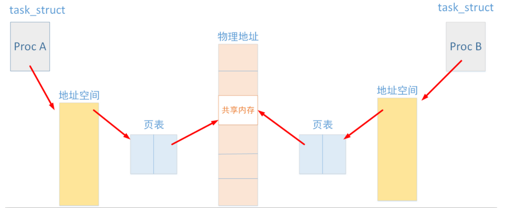
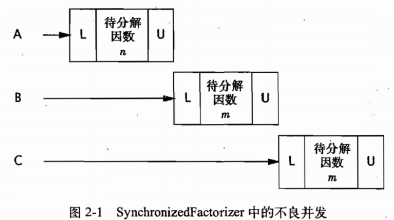
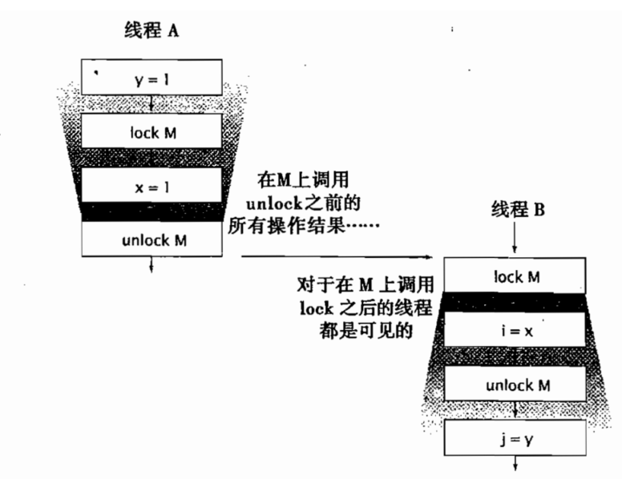

# Java并发编程

## 一. 基础知识

### 1. 简介

1. **Amdahl定律**

    **公式** ：    $$ S=\frac{1}{1-a+\frac{a}{n}} $$

    ​			a = 并行计算部分所占比例    n = 并行处理结点个数

2. **进程通信**

    1. Socket 套接字

        **应用层通过传输层进行数据通信时**，TCP和UDP会遇到同时为多个应用程序进程提供并发服务的问题。多个TCP连接或多个应用程序进程可能需要 通过**同一个TCP协议端口传输数据**。为了**区别不同的应用程序进程和连接**，许多计算机操作系统为应用程序与TCP／IP协议交互提供了称为套接字 (Socket)的接口，区分不同应用程序进程间的网络通信和连接。

    2. 信号处理器

    3. 共享内存

        允许**两个不相关的进程访问同一个逻辑内存**，共享内存是两个正在运行的进程之间共享和传递数据的一种非常有效的方式。

        

    4. 信号量

        信号量的使用主要是用来**保护共享资源**，使得资源在一个时刻只有一个进程（线程）所拥有。信号量的值为正的时候，说明它空闲。所测试的线程可以锁定而使用它。若为0，说明它被占用，测试的线程要进入睡眠队列中，等待被唤醒。使得在任一时刻只能有一个执行线程访问代码的**临界区域**。

3. 操作系统实现多线程的原因：资源利用率；公平性；便利性

4. **线程**

    * 现代操作系统的**基本调度单位**。

    * 如果没有明确的协同机制，线程彼此**独立执行**。

    * 同一个进程中的**所有线程**将**共享**进程的**内存**地址空间。

    * 线程的优势：

        1. 通过**提高处理器资源利用率**来提升系统吞吐率，发挥多处理器的优势。
        2. 通过**分解复杂的异步任务**为一组简单的工作流，使建模更加简单。

    * 线程的风险：

        1. **安全性** 

            在没有充足的同步情况下，多个线程中的操作执行步骤是不可预测的。安全性是不可破坏的。

        2. **活跃性**

            指某件事情最终会发生。当某个操作无法继续执行下去时，便会引发活跃性问题。

        3. **性能问题**

            指希望正确的事件尽快发生，频繁的上下文切换等操作将带来极大开销。

5. Java中涉及线程的类

    * **Timer**
    * **Servlet** & JavaServer Page
    * **远程方法调用**（Remote Method Invocation，RMI）
    * Swing & AWT

### 2. 线程安全性

1. 编写线程安全的代码核心在于对**状态访问操作**进行管理，特别是对**共享的**(Shared)和**可变的**(Mutable)状态的访问。
2. 对象状态：指储存在**状态变量(**例如实例或静态域的)中的数据。
3. 一个对象是否需要是线程安全的，取决于他**是否被多个线程访问**。
4. 修复并发问题的三个方向：
    * 在线程之间**禁止共享该状态变量**。
    * 将状态变量修改为**不可变的变量**。
    * 在访问状态变量时使用**同步**。
5. 当设计线程安全的类时，良好的**面向对象技术、不可修改性、以及明确的不可变性规范**都能起一定的帮助作用。
6. 首先使代码正确运行，然后再提高代码的速度。
7. 线程安全类与线程安全程序**没有绝对联系**。在任何情况下，只有当类中**仅包含自己的状态**时，线程安全类才是有意义的。

> #### 2.1 什么是线程安全性

1. **正确性**：某个类的行为与其规范完全一致。在良好的规范中通常会定义各种不变性条件(Invariant)来约束对象的状态，以及定义各种后验条件(Postcondition)来描述对象的**操作结果**。
2. **线程安全性**：当多个线程访问某个类，不管运行环境采用**何种调度方式**或者这些进程将如何调用，并且在主调代码中**不需要额外的同步或协同**，都能表现出**正确的行为**，这就是线程安全的。
3. 在线程安全类的对象实例上执行的任何串行或并行操作都不会使对象处于无效状态。
4. 在线程安全类中封装了必要的同步机制，因此客户端**无须**进一步采用同步措施。
5. **无状态**:*它既不包含任何域*,也不包含任何对其他类中域的引用。**无状态对象一定是线程安全的**。

> #### 2.2 原子性

1. **原子性**：一组语句作为**不可分割**的单元执行。

2. **竞态条件**：在并发编程过程中，这种由于不恰当的执行时序而出现不正确的结果的情况。最常见的竞态条件是“先检查后执行(Check-Then-Act)”操作，通过一个**可能失效的观测结果**来决定下一步的动作。

3. 原子操作：指对于访问同一个状态的所有操作是一个以原子方式执行的操作。

4. 复合操作：包含一组必须以原子方式执行的操作以确保线程安全性。

5. 在实际操作中，应尽可能地使用**现有的线程安全对象**。判断线程安全对象的可能状态及其状态转换情况要更容易，从而更容易**维护**和**验证**线程安全性。

    ```java
    @ThreadSafe
    public class CountingFactorizer implements Servlet {
    	private final AtomicLong count = new AtomicLong(0);
    	
    	public long getCount () { return count.get(); }
     	
     	public void service (ServletRequest req, ServletResponse resp) {
    		BigInteger i = extractFromRequest(req);
    		BigInteger[] factors = factor(i);
    		count.incrementAndGet();
    		encodeIntoResponse(resp, factors);
    	}
    }
    ```

> #### 2.3 加锁机制

1. 要保持状态一致性，就需要在单个原子操作更新所有相关的状态变量。
2. **内置锁(Intrinsic Lock)**：每个**Java对象**都可以用作一个**实现同步的锁**。线程在进入同步代码块之前会自动获得锁，并且在退出时自动释放锁。
3. **重入**：如果某个线程试图获得一个已经由他自己持有的锁，那么这个请求就会成功。“重入”意味着锁的**操作粒度是线程**。

> #### 2.4 用锁来保护状态

1. 对于可能被多个线程同时访问的可变状态变量，在访问它时都需要持有同一个锁。在这种状态下，我们称**状态变量是由这个锁保护**。
2. 每个共享的和可变的变量都应该只由**一个锁保护**，从而便于维护人员理解锁与状态的关系。
3. **对象的串行**（Serializing Access）访问与对象的序列化（Seriaiization，将对象转化为字节流）操作毫不相干。
4. 对于每个包含**多个变量的不变性条件**，其中涉及的所有变量都需要由同一个锁来保护。

> #### 2.5 活跃性与性能

1. **不良并发应用程序**（Poor Concurrency）：可同时调用的数量，不仅受到可用处理资源的限制，还受到应用程序本身结构的限制。可以通过缩小同步代码块范围提高性能。

    

    2. 实例代码

        ```java
        @ThreadSafe
        public class CachedFactorizer implements Servlet {
        	@GuardedBy("this") private BigInteger lastNumber;
        	@GuardedBy("this") private BigInteger[] lastFactors;
        	@GuardedBy("this") private long hits;
        	@GuardedBy("this") private long cacheHits;
        	
        	public synchronized long getHits () { return hits; }
        	public synchronized double getCacheHitRatio () {
        		return (double) cacheHits / (double) hits;
        	}
        	
        	public void service (ServletRequest req, ServletResponse resp) {
        		BigInteger i = extractFromRequest(req);
        		BigInteger[] factors = null;
        		synchronized (this) {
        			++hits;
        			if (i.equals(lastNumber)) {
        				++cacheHits;
        				factors = lastFactors.clone();
        			}
        		}
        		if (factors == null) {
        			factors = factor(i);
        			synchronized (this) {
        				lastNumber = i;
        				lastFactors = factors.clone();
        			}
        		}
        		encodeIntoResponse(resp, factors);
        	}
        }
        ```

    3. 在**简单性**与性能之间存在着**相互制约**因素。当实现某个同步策略时，一定不要盲目地为了性能而牺牲简单性（这可能会破坏安全性）。

    4. 当执行**时间较长的计算**或者无法快速完成的操作时（例如，网络I/O或控制台I/O），**一定不要持有锁**。

### 3. 对象的共享

​		我们已经知道了同步代码块和同步方法可以确保以原子的方式执行操作，但一种常见的误解是，认为关健字synchronized只能用于实现原子性或者确定“**临界区**(Critical Section)”。

​		同步还有另一个重要的方面：内存可见性(Memory Visibility)。我们不仅希望防止某个线程正在使用对象状态而另一个线程在同时修改该状态，而且希望确保当一个线程修改了对象状态后，其他线程能够看到发生的状态化。如果没有同步，那么这种情况就无法实现。你可以通过显式的同步或者类库中内置的同步来保证对象被安全地发布。

> #### 3.1 可见性

1. 通常，我们无法确保执行读操作的线程能适时地看到其他线程写入的值，有时甚至是根本不可能的事情。为了确保多个线程之间对内存写入操作的可见性，必须使用同步机制。

    ```java
    /**
    * 由于重排序现象，ReaderThread 线程很有可能输出的number为0。
    **/
    public class Novisibility {
    	private static boolean ready;
    	private static int number;
    	
    	private static class ReaderThread extends Thread {
    		public void run () {
    			while (!ready) {
    				Thread.yield();
    			}
    			System.out.println(number);
    		}
    	}
    	
    	public static void main (String[] args) {
    		new ReaderThread().start();
    		number = 42;
    		ready = true;
    	}
    }
    ```

2. 在没有同步的情况下，编译器、处理器以及运行时等都可能对操作的执行顺序进行一些意想不到的调整（**重排序**）。在缺乏足够同步的多线程程序中，要想对内存操作的执行顺序进行判断，几乎无法得出正确的结论。

    > 3.1.1 失效数据

    1. 失效数据：**过时**的数据。

    2. 失效值可能会导致一些严重的安全问题或者活跃性问题。

    3. 由于get和set都是在没有同步的情况下访问value，某个线程调用了set，另外正在调用get的线程可能看到更新后的value，也可能看不到。

        ```java
        @ThreadSafe
         public class MutableInteger{
         	@GuardedBy("this") private int value;
         	public synchronized  int get(){return value;}
         	public synchronized  void set(int value){this.value = value;}
        }
        ```

    > 3.1.2 非原子的64位操作

    1. **最低安全性**（out-of-thin-airsafety）:当线程在==没有同步==的情况下读取变量时，可能会得到一个失效值，但**至少这个值是由之前某个线程设置的值**，而不是一个随机值的一种安全性保证。
    2. 最低安全性适用于绝大多数的变量，但是**对非volatile类型的64位数值变量(double和long)例外**。对于非volatile类型的64位数值变量(double和long)变量，**JVM会将64位的读、写操作分解成两个32位操作。**当读取一个非volatile类型的long变量时，如果对该变量的读和写操作在不同的线程中，那么很有可能会读取到某个值的高32位和低32位。除非用==**关键字volatile**==或者锁保护起来。

    > 3.1.3 加锁与可见性

    1. 内置锁可以用于确保**某个线程以一种可预测的方式来查看另一个线程**的执行结果。

        

    2. 加锁的含义**不仅仅局限于互斥行为，还包括内存的可见性**。为了确保所有线程都能看到共享变量的最新值，所有执行读操作或者写操作的线程都必须在同一个锁上同步。

    > 3.1.4 Volatile变量

    1. volatile变量是一个比sychronized关键字更轻量级的同步机制。
    2. **JVM调试提示**：对于服务器应用程序，无论在开发阶段还是测试阶段，当启动JVM时一定要指定 - server命令行选项。server模式JVM会进行更多优化，也同时会出现一些问题。
    3. 当且仅当满足下面所有条件是，才可用volatile变量：
        * 对变量读写操作不依赖变量本身当前值
        * 该变量不会和其他状态变量一起纳入不变性条件中
        * 在访问变量时不需要加锁。

> #### 3.2 发布与逸出

1. **发布**：使对象能够在当前作用域之外的代码中使用。例如，将一个指向该对象的引用保存至其他方法可以访问的地方，或者在某一个非私有的方法中返回该引用，或者将引用传递到其他类的方法中。

2. **逸出**：某个不应该发布的对象被发布时，这种情况被称为逸出。

3. 实例分析：

    1. 在非私有的方法返回私有变量的引用，内部可变状态逸出了

        ```java
         class UnsafeStates{
           private String[] states = new String[] {
           	"AK","AL",....
           };
           public String[] getStates() {return states;}
        } 
        ```

    2. 隐式的适用this引用逸出

        ```java
           public	class ThisEscape{
           		public ThisEscape(EventSource source){
           			source.registerListener(
           			new EventListener(){
           			public void onEvent(Event e){
           					doSomething(e);
           					}
           			});
           	}
        }
        ```

        ​		内部类在编译完成后会**隐含保存一个它外围类的引用，"ThisEscape.this”**，然而构造函数还没完成，ThisEscape在执行构造函数，其本身对象还没构造完，this引用就立刻间接被传递到其他类的方法中，这当然是不应该的，所以是**隐式的逸出**。正确的做法是构造函数返回时，this引用才能从线程中逸出，才能在该线程中被其他类的方法使用。

        ```java
        public class SafeListener{
           private final EventListener listener;
           private SafeListener(){
           listener  = new EventListener(){
           public void onEvent(Event e)
           {
           		doSomething(e);
           }; //在构造函数结束之前，外部类this的引用并没有被其他类的方法引用，并没有被发布，所以没有逸出
        }
        public static SafeListener newInstance(EventSource source){
           	SafeListener safe  = new SafeListener();
           	souce registerListener(safe.listener);
           	return safe;
           }
        }
        ```

        ​		只有构造函数返回后，外部类的this才能被引用，此时外部类的对象已经构造完整。

> #### 3.3 线程封闭