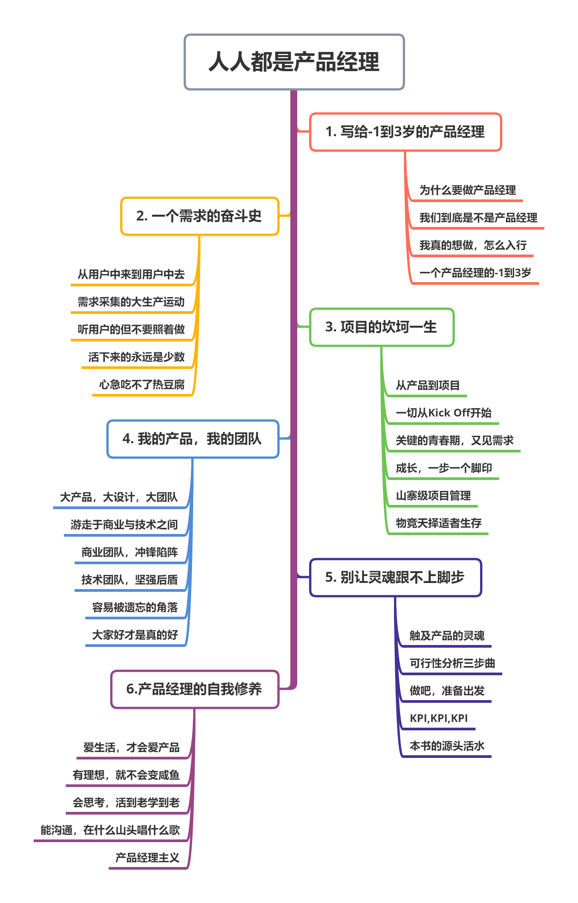
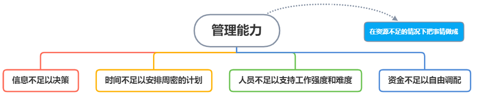

# 人人都是产品经理

## 第一章 写给-1到3岁的产品经理

### 1.1 为什么要做产品经理

> 产品经理的信仰：**好产品能改变世界**

1. 为了让用户少思考，因为绝大多数用户不会仔细阅读。
2. 产品功能改进的持续方向：让用户更省心。

### 1.2 我们到底是不是产品经理

1. #### 产品

    1. 产品是什么

        > * 一组将输入转化为输出的相互关联或相互作用的活动。
        > * 可以满足人们需求的载体。
        > * **产品就是用来解决某个问题的东西**。

    2. 产品这个东西可以是有形的实体，也可以是无形的服务。

    3. 好产品要解决用户的问题的同时解决公司的问题，**一个都不能少**！

2. #### 产品经理的变化

    | 对比项             | 典型的传统行业 | 互联网、软件行业 |
    | ------------------ | -------------- | ---------------- |
    | 行业形态           | 成熟行业       | 新兴行业         |
    | 产品形态与成本结构 | 实物           | 虚拟物品         |
    | 生命周期           | 几年           | 几个月           |
    | 赢利模式           | 单一卖产品赚钱 | 多元赢利         |
    | 用户心态           | 花钱买         | 免费使用         |

    1. **行业形态**
        * 传统行业：市场成熟，产品已定型，只有渐变式创新； 用户成熟，习惯难以改变；偏重于营销类创新
        * 互联网、软件行业：不断在变，产品本身不断突破，用户看什么都是新的，只有**先入为主，占领用户**才能**主导用户习惯**，重头戏在前头，偏重研发类创新
        * 衍生工作职责：对市场发展趋势有敏锐的洞察力和创新意识及分析能力、研判能力，并不断改进产品；深入了解业务，挖掘用户的多种需求，不断推出有竞争力的产品
    2. 产品形态与成本结构
        * 传统行业：产品为实物，有大量的制造成本，同时需采购、仓储、物流等分工中打通供应链，并考虑销售、分销、促销。
        * 互联网、软件行业：虚拟物品，公司成本集中在研发成本。重点资源在于产品本身，**特别是需求分析、涉及的细节，杠杆效应明显**。
        * 衍生工作职责：善于利用设计工具完成产品UC设计和Demo制作
    3. 生命周期
        * 传统行业：几年，流程精细、复杂，评审点多，需要的人员较为专业，有问题只能召回
        * 新兴行业：几个月，研发管理过程精简，评审点少，有问题能及时快速修改并进行补丁升级，**船小好调头**
        * 衍生工作职责：发起产品研发项目，组织实施产品，对效益负责
    4. 赢利模式
        * 传统行业：通过多卖产品，或直销或渠道分销即拷产品的价值来赚取利润。为付钱的客户而做
        * 新兴行业：产品本身免费，通过其他的赢利如广告来赚钱，用户量大自然能赚钱。**用户为终端用户**
        * 衍生工作职责：负责用户研究，把握用户需求，实现用户需求
    5. 用户心态
        * 传统行业：东西是买来花了钱的，只能凑合着用，不会把产品扔了立刻买个新的
        * 新兴行业：大多数免费，每类产品雷同的多，**用户觉得不爽便会流失**
        * 衍生工作职责：重视用户体验如交互设计、视觉设计、文案设计

3. #### 非典型产品经理

    1. **三大方向：**

        1. **产品管理团队**：团队的力量来代替单一的产品经理
        2. **事业单位经理的任用**：把产品强调为一个事业单位，而产品经理也就摇身一变成为了事业部的总经理，区别在于总经理有了更大的权力
        3. **更专业取向**：想要更了解产品与它面临的竞争情况，最终目的是要满足顾客的需求。

    2. 管理能力

        