# SpringBoot 高级

# 一. 缓存

## 1. JSR107

Java Caching定义了5个核心接口，分别是**CachingProvider**, **CacheManager**, **Cache**, **Entry** 和 **Expiry**。

* **CachingProvider**定义了创建、配置、获取、管理和控制多个CacheManager。一个应用可以在运行期访问多个CachingProvider。
* **CacheManager**定义了创建、配置、获取、管理和控制多个唯一命名的Cache，这些Cache 存在于CacheManager的上下文中。一个CacheManager仅被一个CachingProvider所拥有。
* **Cache**是一个类似Map的数据结构并临时存储以Key为索引的值。一个Cache仅被一个 CacheManager所拥有。
* **Entry**是一个存储在Cache中的key-value对。
* **Expiry** 每一个存储在Cache中的条目有一个定义的有效期。一旦超过这个时间，条目为过期 的状态。一旦过期，条目将不可访问、更新和删除。缓存有效期可以通过ExpiryPolicy设置。

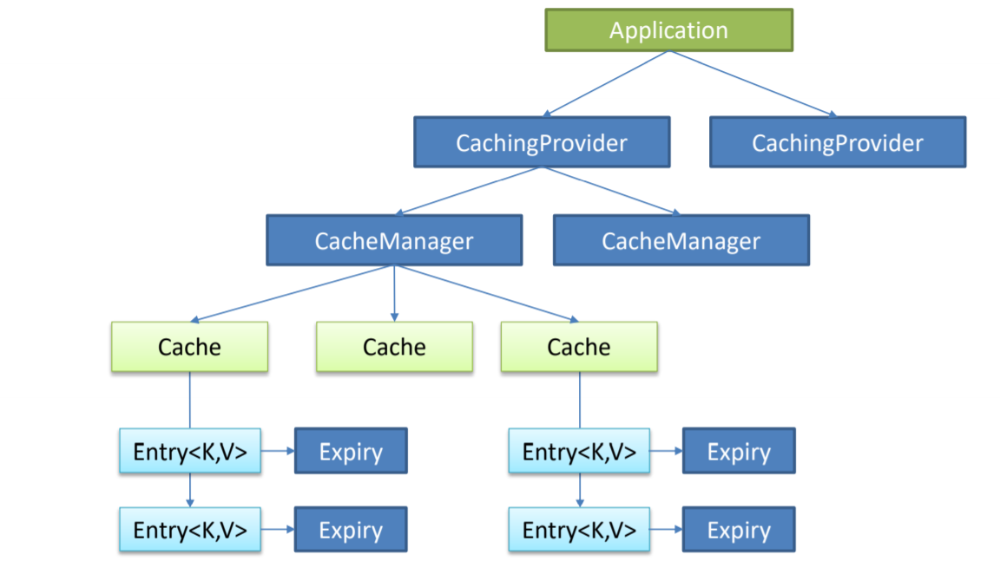

## 2. Spring缓存抽象

Spring从3.1开始定义了`org.springframework.cache.Cache` 和`org.springframework.cache.CacheManager`接口来统一不同的缓存技术； 并支持使用`JCache（JSR-107）注解`简化我们开发；

* Cache接口为缓存的组件规范定义，包含缓存的各种操作集合；

* Cache接口下Spring提供了各种xxxCache的实现；如RedisCache，EhCacheCache , ConcurrentMapCache等；

* 每次调用需要缓存功能的方法时，Spring会检查检查指定参数的指定的目标方法是否 已经被调用过；如果有就直接从缓存中获取方法调用后的结果，如果没有就调用方法 并缓存结果后返回给用户。下次调用直接从缓存中获取。

* 使用Spring缓存抽象时我们需要关注以下两点

   > 1、确定方法需要被缓存以及他们的缓存策略 
   >
   > 2、从缓存中读取之前缓存存储的数据

## 3.重要概念&缓存注解
| 概念/注解 | 含义 |
| ------------------ | ------------------------------------------------------------ |
| **Cache**          | 缓存接口，定义缓存操作。实现有：RedisCache、EhCacheCache、ConcurrentMapCache等 |
| **CacheManager**   | 缓存管理器，管理各种缓存（Cache）组件                        |
| **@Cacheable**     | 主要针对方法配置，能够根据方法的请求参数对其结果进行缓存     |
| **@CacheEvict**    | 清空缓存                                                     |
| **@CacheConfig** | 统一设置属性 cacheNames、keyGenerator、cacheManager、cacheResolver |
| **@CachePut**      | 保证方法被调用，又希望结果被缓存。[注意key的一致性]              |
| **@EnableCaching** | 开启基于注解的缓存                                           |
| **keyGenerator**   | 缓存数据时key生成策略                                        |
| **serialize**      | 缓存数据时value序列化策略                                    |

**@Cacheable/@CachePut/@CacheEvict主要的参数**

| 名称                                          | 解释                                                         | 示例                                                         |
| --------------------------------------------- | :----------------------------------------------------------- | ------------------------------------------------------------ |
| **value**                                     | 缓存的名称，在spring 配置文件中定义，必须指定至少一个        | @Cacheable(value=”mycache”) 或者 @Cacheable(value={”cache1”,”cache2”} |
| **key**                                       | 缓存的  key，可以为空，如果指定要按照  SpEL 表达式编写，如果不指定，则缺省按照方法的所有参数进行组合 | @Cacheable(value=”testcache”,<br/>key=”#userName”)           |
| **condition**                                 | 缓存的条件，可以为空，使用  SpEL 编写，返回  true 或者 false，只有为  true 才进行缓存/清除缓存，在调用方法之前之后都能判断 | @Cacheable(value=”testcache”,<br/>condition=”#userName.length()>2”) |
| **allEntries**  (**@CacheEvict**  )           | 是否清空所有缓存内容，缺省为  false，如果指定为 true，则方法调用后将立即清空所有缓存 | @CachEvict(value=”testcache”,<br/>allEntries=true)           |
| **beforeInvocation  (@CacheEvict)**           | 是否在方法执行前就清空，缺省为  false，如果指定为 true，则在方法还没有执行的时候就清空缓存，缺省情况下，如果方法执行抛出异常，则不会清空缓存 | 例如：  @CachEvict(value=”testcache”，beforeInvocation=true) |
| **unless**  **(@CachePut)**  **(@Cacheable)** | 用于否决缓存的，不像condition，该表达式只在方法执行之后判断，此时可以拿到返回值result进行判断。条件为true不会缓存，fasle才缓存 | @Cacheable(value=”testcache”,<br/>unless=”#result  == null”) |

**Cache SpEL available metadata**

| **名字**        | **位置**           | **描述**                                                     | **示例**             |
| --------------- | ------------------ | ------------------------------------------------------------ | -------------------- |
| methodName      | root object        | 当前被调用的方法名                                           | #root.methodName     |
| method          | root object        | 当前被调用的方法                                             | #root.method.name    |
| target          | root object        | 当前被调用的目标对象                                         | #root.target         |
| targetClass     | root object        | 当前被调用的目标对象类                                       | #root.targetClass    |
| args            | root object        | 当前被调用的方法的参数列表                                   | #root.args[0]        |
| caches          | root object        | 当前方法调用使用的缓存列表（如@Cacheable(value={"cache1",  "cache2"})），则有两个cache | #root.caches[0].name |
| *argument name* | evaluation context | 方法参数的名字. 可以直接 #参数名 ，也可以使用 #p0或#a0 的形式，0代表参数的索引； | #iban 、 #a0 、 #p0  |
| result          | evaluation context | 方法执行后的返回值（仅当方法执行之后的判断有效，如‘unless’，’cache put’的表达式 ’cache evict’的表达式beforeInvocation=false） | #result              |

## 4. springboot-cache缓存使用

1. 引入spring-boot-starter-cache模块

    ```xml
    <dependency>
        <groupId>org.springframework.boot</groupId>
        <artifactId>spring-boot-starter-cache</artifactId>
    </dependency>
    ```

2. @EnableCaching开启缓存

3. 使用缓存注解

4. 切换为其他缓存

**原理：**

1. 自动配置类；CacheAutoConfiguration

2. 缓存的配置类
    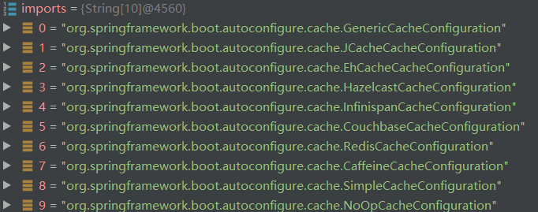

    **默认生效：`SimpleCacheConfiguration`**

3. 给容器中注册了一个CacheManager：ConcurrentMapCacheManager

4. 可以获取和创建ConcurrentMapCache类型的缓存组件；他的作用将数据保存在ConcurrentMap中；

**运行流程：**
**@Cacheable**：

1. 方法运行之前，先去查询Cache（缓存组件），按照cacheNames指定的名字获取；
          （CacheManager先获取相应的缓存），第一次获取缓存如果没有Cache组件会自动创建。

2. 去Cache中查找缓存的内容，使用一个key，默认就是方法的参数；

    key是按照某种策略生成的；默认是使用keyGenerator生成的，默认使用SimpleKeyGenerator生成key

    SimpleKeyGenerator生成key的默认策略：

    > 如果没有参数；key=new SimpleKey()
    >
    > 如果有一个参数：key=参数的值
    >
    > 如果有多个参数：key=new SimpleKey(params)

    **注意：**在同一个cache中如果参数相同，使用默认key的时候，由于前一个查询方法已经缓存结果会导致不同方法会查出同一个结果，出现错误

    ```java
    @Cacheable(value = "users" )
    public User queryUserByName(String name) {
        return userRepository.findUser(name);
    }
    
    @Cacheable(value = "users" )
    public User queryUserByPassword(String pwd) {
        return userRepository.findUserPwd(pwd);
    }
    ```

3. 没有查到缓存就调用目标方法

4. 将目标方法返回的结果，放进缓存中

   @Cacheable标注的方法执行之前先来检查缓存中有没有这个数据，默认按照参数的值作为key去查询缓存，
   如果没有就运行方法并将结果放入缓存；以后再来调用就可以直接使用缓存中的数据；

**核心：**

1. 使用CacheManager `ConcurrentMapCacheManager`按照名字得到Cache `ConcurrentMapCache`组件
2. key使用keyGenerator生成的，默认是`SimpleKeyGenerator`

## 5. redis

1. 引入spring-boot-starter-data-redis

```shell
docker run -p 6379:6379 --name redis01 -v /home/app/redis/redis.conf:/etc/redis/redis.conf -v /home/app/redis/data:/data -d redis
docker exec -it redis01 bash
redis-cli
```

2. application.yml配置redis连接地址

3. 使用RestTemplate操作redis

    > **Redis常见的五大数据类型**
    > String（字符串）、List（列表）、Set（集合）、Hash（散列）、ZSet（有序集合）
    >
    > 1. stringRedisTemplate.opsForValue()[String（字符串）]
    > 2. stringRedisTemplate.opsForList()[List（列表）]
    > 3. stringRedisTemplate.opsForSet()[Set（集合）]
    > 4. stringRedisTemplate.opsForHash()[Hash（散列）]
    > 5. stringRedisTemplate.opsForZSet()[ZSet（有序集合）]

    

    > 对象需要实现**`Serializable`** 接口
    >
    > 默认如果保存对象，使用jdk序列化机制，序列化后的数据保存到redis中
    >
    > ```java
    > @Autowired
    > StringRedisTemplate stringRedisTemplate;  //操作k-v都是字符串的
    > @Autowired
    > RedisTemplate redisTemplate;  //k-v都是对象的
    > 
    > redisTemplate.opsForValue().set("emp-01",empById);
    > ```
    >
    >  将数据以json的方式保存
    >
    > 1. 自己将对象转为json
    >
    > 2. redisTemplate默认的序列化规则；改变默认的序列化规则
    >
    >     ```java
    >     @Configuration
    >     public class MyRedisConfig {
    >         @Bean
    >         public RedisTemplate<Object, Object> myRedisTemplate(
    >                 RedisConnectionFactory redisConnectionFactory)
    >                 throws UnknownHostException {
    >             RedisTemplate<Object, Object> template = new RedisTemplate<Object, Object>();
    >             template.setConnectionFactory(redisConnectionFactory);
    >             Jackson2JsonRedisSerializer<Object> ser = new Jackson2JsonRedisSerializer<Object>(Object.class);
    >             template.setDefaultSerializer(ser);
    >             return template;
    >         }
    >     }
    >     ```
    >
    >     ```java
    >     @Autowired
    >     RedisTemplate<Object, Employee> myRedisTemplate;
    >     
    >     myRedisTemplate.opsForValue().set("emp-01",empById);
    >     ```

4. 配置缓存   CacheManagerCustomizers

    ```java
    @Configuration
    public class MyRedisConfig {
    	@Bean
        public CacheManager cacheManager(RedisConnectionFactory redisConnectionFactory) {
            //初始化一个RedisCacheWriter
            RedisCacheWriter redisCacheWriter = RedisCacheWriter.nonLockingRedisCacheWriter(redisConnectionFactory);
            //设置CacheManager的值序列化方式为json序列化
            RedisSerializer<Object> jsonSerializer = new GenericJackson2JsonRedisSerializer();
            RedisSerializationContext.SerializationPair<Object> pair = RedisSerializationContext.SerializationPair
                    .fromSerializer(jsonSerializer);
            RedisCacheConfiguration defaultCacheConfig=RedisCacheConfiguration.defaultCacheConfig()
                    .serializeValuesWith(pair);
            //设置默认超过期时间是30秒
            defaultCacheConfig.entryTtl(Duration.ofSeconds(30));
            //初始化RedisCacheManager
            return new RedisCacheManager(redisCacheWriter, defaultCacheConfig);
        }
    }
    ```

5. 测试使用缓存、切换缓存、 CompositeCacheManager


---

# 二. 消息队列 MessageQueue

## 1. 消息队列基础

### 1. 作用

1. **解耦**
2. **异步**
3. **消峰**

### 2. 缺点

1. **系统复杂度提高**
2. **一致性问题**

### 3. 重要概念

消息代理（message broker）和目的地（destination）

当消息发送者发送消息以后，将由消息代理接管，消息代理保证消息传递到指定目的地。

### 4. 主要目的地形式

1. **队列**（queue）：点对点消息通信（point-to-point）

2. **主题**（topic）：发布（publish）/订阅（subscribe）消息通信

### 5. 收发方式

1. 点对点式
    * 消息发送者发送消息，消息代理将其放入一个队列中，消息接收者从队列中获取消息内容，消息读取后被移出队列
    * 消息只有唯一的发送者和接受者，但并不是说只能有一个接收者

2. 发布订阅式
    * 发送者（发布者）发送消息到主题，多个接收者（订阅者）监听（订阅）这个主题，那么就会在消息到达时同时收到消息

### 6.消息服务规范

1. JMS（Java Message Service）JAVA消息服务

    基于JVM消息代理的规范。ActiveMQ、HornetMQ是JMS实现

2. AMQP（Advanced Message Queuing Protocol）

    高级消息队列协议，也是一个消息代理的规范，兼容JMS

    RabbitMQ是AMQP的实现

    |              | JMS                                                          | AMQP                                                         |
    | ------------ | ------------------------------------------------------------ | ------------------------------------------------------------ |
    | 定义         | Java  api                                                    | 网络线级协议                                                 |
    | 跨语言       | 否                                                           | 是                                                           |
    | 跨平台       | 否                                                           | 是                                                           |
    | Model        | 提供两种消息模型：  （1）、Peer-2-Peer  （2）、Pub/sub       | 提供了五种消息模型：  （1）、direct  exchange  （2）、fanout  exchange  （3）、topic  change  （4）、headers  exchange  （5）、system  exchange  本质来讲，后四种和JMS的pub/sub模型没有太大差别，仅是在路由机制上做了更详细的划分； |
    | 支持消息类型 | 多种消息类型：  TextMessage  MapMessage  BytesMessage  StreamMessage  ObjectMessage  Message  （只有消息头和属性） | byte[]  当实际应用时，有复杂的消息，可以将消息序列化后发送。 |
    | 综合评价     | JMS  定义了JAVA  API层面的标准；在java体系中，多个client均可以通过JMS进行交互，不需要应用修改代码，但是其对跨平台的支持较差； | AMQP定义了wire-level层的协议标准；天然具有跨平台、跨语言特性。 |

### 7. Spring支持

1. Spring支持
    * spring-jms提供了对JMS的支持
    * spring-rabbit提供了对AMQP的支持
    * 需要ConnectionFactory的实现来连接消息代理
    * 提供JmsTemplate、RabbitTemplate来发送消息
    * @JmsListener（JMS）、@RabbitListener（AMQP）注解在方法上监听消息代理发布的消息
    * @EnableJms、@EnableRabbit开启支持

2. Spring Boot自动配置
    * JmsAutoConfiguration
    * RabbitAutoConfiguration

## 2. RabbitMQ

### 1.RabbitMQ简介

1. RabbitMQ是一个由erlang开发的AMQP(Advanved Message Queue Protocol)的开源实现。

2. **核心概念**

    * **Message**

        消息，消息是不具名的，它由消息头和消息体组成。消息体是不透明的，而消息头则由一系列的可选属性组成，这些属性包括routing-key（路由键）、priority（相对于其他消息的优先权）、delivery-mode（指出该消息可能需要持久性存储）等。

    * **Publisher**

        消息的生产者，也是一个向交换器发布消息的客户端应用程序。

    * **Exchange**

        交换器，用来接收生产者发送的消息并将这些消息路由给服务器中的队列。

        Exchange有4种类型：direct(默认)，fanout, topic, 和headers，不同类型的Exchange转发消息的策略有所区别

    * **Queue**

        消息队列，用来保存消息直到发送给消费者。它是消息的容器，也是消息的终点。一个消息可投入一个或多个队列。消息一直在队列里面，等待消费者连接到这个队列将其取走。

    * **Binding**

        绑定，用于消息队列和交换器之间的关联。一个绑定就是基于路由键将交换器和消息队列连接起来的路由规则，所以可以将交换器理解成一个由绑定构成的路由表。

        Exchange 和Queue的绑定可以是多对多的关系。

    * **Connection**

        网络连接，比如一个TCP连接。

    * **Channel**

        信道，多路复用连接中的一条独立的双向数据流通道。信道是建立在真实的TCP连接内的虚拟连接，AMQP 命令都是通过信道发出去的，不管是发布消息、订阅队列还是接收消息，这些动作都是通过信道完成。因为对于操作系统来说建立和销毁 TCP 都是非常昂贵的开销，所以引入了信道的概念，以复用一条 TCP 连接。

    * **Consumer**

        消息的消费者，表示一个从消息队列中取得消息的客户端应用程序。

    * **Virtual Host**

        虚拟主机，表示一批交换器、消息队列和相关对象。虚拟主机是共享相同的身份认证和加密环境的独立服务器域。每个 vhost 本质上就是一个 mini 版的 RabbitMQ 服务器，拥有自己的队列、交换器、绑定和权限机制。vhost 是 AMQP 概念的基础，必须在连接时指定，RabbitMQ 默认的 vhost 是 / 。

    * **Broker**

        表示消息队列服务器实体

        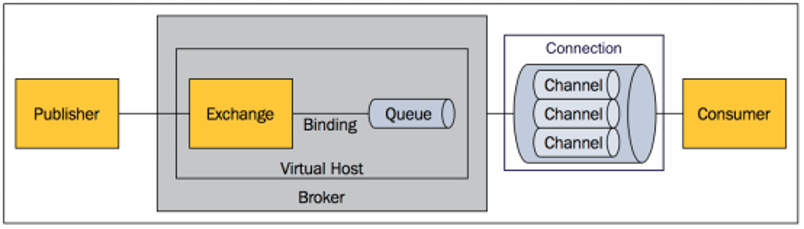

### 2. RabbitMQ运行机制

1. **AMQP 中的消息路由**

    AMQP 中消息的路由过程和 Java 开发者熟悉的 JMS 存在一些差别，AMQP 中增加了 **Exchange** 和 **Binding** 的角色。生产者把消息发布到 Exchange 上，消息最终到达队列并被消费者接收，而 Binding 决定交换器的消息应该发送到那个队列。

    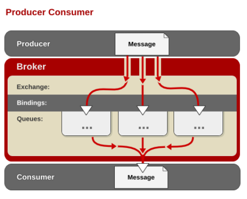

2. **Exchange 类型**

    **Exchange**分发消息时根据类型的不同分发策略有区别，目前共四种类型：**direct**、**fanout**、**topic**、**headers** 。headers 匹配 AMQP 消息的 header 而不是路由键， headers 交换器和 direct 交换器完全一致，但性能差很多，目前几乎用不到了，所以直接看另外三种类型：

    * **Direct Exchange**

        消息中的路由键（routing key）如果和 Binding 中的 binding key 一致， 交换器就将消息发到对应的队列中。路由键与队列名完全匹配，如果一个队列绑定到交换机要求路由键为“dog”，则只转发 routing key 标记为“dog”的消息，不会转发“dog.puppy”，也不会转发“dog.guard”等等。它是完全匹配、单播的模式。

        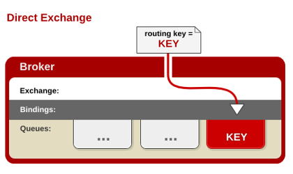

    * **Fanout  Exchange**

        每个发到 fanout 类型交换器的消息都会分到所有绑定的队列上去。fanout 交换器不处理路由键，只是简单的将队列绑定到交换器上，每个发送到交换器的消息都会被转发到与该交换器绑定的所有队列上。很像子网广播，每台子网内的主机都获得了一份复制的消息。fanout 类型转发消息是最快的。

        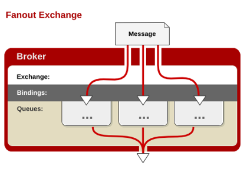

    * **Topic Exchange**

        topic 交换器通过模式匹配分配消息的路由键属性，将路由键和某个模式进行匹配，此时队列需要绑定到一个模式上。它将路由键和绑定键的字符串切分成单词，这些**单词之间用点隔开**。它同样也会识别两个通配符：符号“ # ”和符号“ * ”。#匹配0个或多个单词，\*匹配一个单词。

        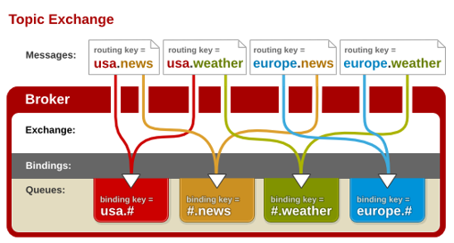

    ### 3. 整合RabbitMQ

    1. docker运行rabbitmq

        ```shell
        docker run -d -p 5672:5672 -p 15672:15672 --name rabbitmq01 rabbitmq:management
        ```
        
    2. 默认管理账号密码 guest
    
    3. 创建队列和交换器
    
        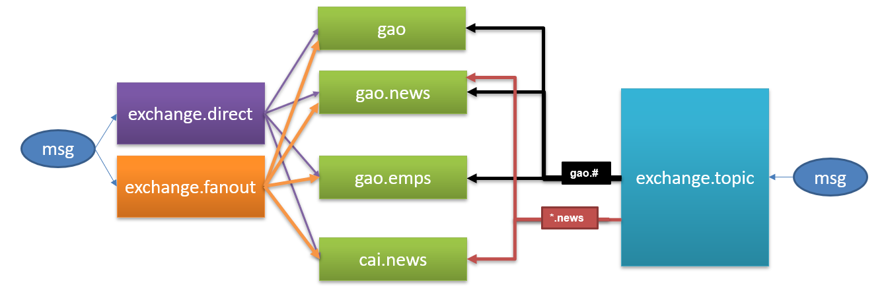
    
    4. 引入 spring-boot-starter-amqp
    
    5. application.yaml配置
    
    6. 测试RabbitMQ
        1. AmqpAdmin：管理组件
        2. RabbitTemplate：消息发送处理组件
    
        ```java
        @Configuration
        public class MyAMQPConfig {    //jason转换配置类
            @Bean
            public MessageConverter messageConverter(){
                return new Jackson2JsonMessageConverter();
            }
        }
        ```
    
        ```java
        @Autowired
        RabbitTemplate rabbitTemplate;
        //Message需要自己构造一个;定义消息体内容和消息头
        //rabbitTemplate.send(exchage,routeKey,message);
        //object默认当成消息体，只需要传入要发送的对象，自动序列化发送给rabbitmq；
        //rabbitTemplate.convertAndSend(exchage,routeKey,object);
        Map<String,Object> map = new HashMap<>();
        map.put("msg","这是第一个消息");
        map.put("data", Arrays.asList("helloworld",123,true));
        //对象被默认序列化以后发送出去，配置后可转化为jason类型
        rabbitTemplate.convertAndSend("exchange.direct","gao.news",map);
        Object o = rabbitTemplate.receiveAndConvert("gao.news");
        System.out.println(o.getClass());
    System.out.println(o);
        ```
        
    7. 接收消息
    
        ```java
        @EnableRabbit  //开启基于注解的RabbitMQ模式
        /*********************************/
        @Service
        public class BookService {
        
            @RabbitListener(queues = "gao.news")
            public void receive(Book book){
                System.out.println("收到消息："+book);
            }
        
            @RabbitListener(queues = "gao")
            public void receive02(Message message){
                System.out.println(message.getBody());
                System.out.println(message.getMessageProperties());
            }
        }
        ```
    
    8. 创建控件
    
        ```java
        @Autowired
        AmqpAdmin amqpAdmin;
        //创建交换器
        amqpAdmin.declareExchange(new DirectExchange("amqpadmin.exchange"));
        
        amqpAdmin.declareQueue(new Queue("amqpadmin.queue",true));
        //创建绑定规则
        amqpAdmin.declareBinding(new Binding("amqpadmin.queue", Binding.DestinationType.QUEUE,"amqpadmin.exchange","amqp.haha",null));
        //删除交换器
        amqpAdmin.deleteExchange("amqpadmin.exchange");
        ```


---

# 三. 检索

## 1. 检索

应用经常需要添加检索功能，开源的 [ElasticSearch](https://www.elastic.co/) 是目前全文搜索引擎的首选。他可以快速的存储、搜索和分析海量数据。Spring Boot通过整合Spring Data ElasticSearch为我们提供了非常便捷的检索功能支持；


Elasticsearch是一个分布式搜索服务，提供Restful API，底层基于Lucene，采用多shard（分片）的方式保证数据安全，并且提供自动resharding的功能，github等大型的站点也是采用了ElasticSearch作为其搜索服务，

## 2. 概念

以**员工文档* *的形式存储为例：一个文档代表一个员工数据。存储数据到 ElasticSearch 的行为叫做 *索引* ，但在索引一个文档之前，需要确定将文档存储在哪里。

一个 ElasticSearch 集群可以 包含多个**索引** ，相应的每个索引可以包含多个 **类型** 。 这些不同的类型存储着多个 *文档* ，每个文档又有 多个 **属性**。

类似关系：

* 索引-数据库

* 类型-表

* 文档-表中的记录

* 属性-列

**基本模型**

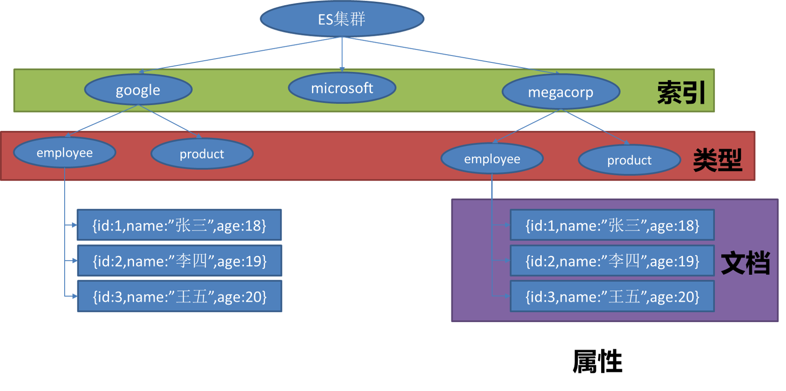

## 3. 整合ElasticSearch测试

1. 启动elasticsearch

    ```shell
    docker run -d -p 9200:9200 -p 9300:9300 --name es01 elasticsearch:7.6.2
    ```

2. PUT 添加/更新    DELETE 删除    GET 获取    HEAD 检查

3. URL /[索引]/[类型]/[标识符]

4. 高级

    1. _search  查询所有
    2. jason 写入查询规则
    3. URL表达式  `_search?q=last_name:Smith`

5. 引入spring-boot-starter-data-elasticsearch

6. 选择Spring Data 对应版本的ElasticSearch

7. application.yml配置

8. Spring Boot自动配置的

9. ElasticsearchRepository、ElasticsearchTemplate、Jest

10. 测试ElasticSearch


---

# 四. 任务

## 1. 异步任务

```java
@EnableAysnc //允许异步任务

//告诉Spring这是一个异步方法
@Async
public void hello(){
    try {
        Thread.sleep(3000);
    } catch (InterruptedException e) {
        e.printStackTrace();
    }
    System.out.println("处理数据中...");
}
```

## 2. 定时任务

**cron表达式：**

| **字段** | **允许值**             | **允许的特殊字符** |
| -------- | ---------------------- | ------------------ |
| 秒       | 0-59                   | , -  * /           |
| 分       | 0-59                   | , -  * /           |
| 小时     | 0-23                   | , -  * /           |
| 日期     | 1-31                   | , -  * ? / L W C   |
| 月份     | 1-12                   | , -  * /           |
| 星期     | 0-7或SUN-SAT  0,7是SUN | , -  * ? / L C #   |

| **特殊字符** | **代表含义**               |
| ------------ | -------------------------- |
| ,            | 枚举                       |
| -            | 区间                       |
| *            | 任意                       |
| /            | 步长                       |
| ?            | 日/星期冲突匹配            |
| L            | 最后                       |
| W            | 工作日                     |
| C            | 和calendar联系后计算过的值 |
| #            | 星期，4#2，第2个星期四     |

```java
@EnableScheduling //允许定时任务
/**************************/
	/**
     * second(秒), minute（分）, hour（时）, day of month（日）, month（月）, day of week（周几）.
     * 0 * * * * MON-FRI
     *  【0 0/5 14,18 * * ?】 每天14点整，和18点整，每隔5分钟执行一次
     *  【0 15 10 ? * 1-6】 每个月的周一至周六10:15分执行一次
     *  【0 0 2 ? * 6L】每个月的最后一个周六凌晨2点执行一次
     *  【0 0 2 LW * ?】每个月的最后一个工作日凌晨2点执行一次
     *  【0 0 2-4 ? * 1#1】每个月的第一个周一凌晨2点到4点期间，每个整点都执行一次；
     */
// @Scheduled(cron = "0 * * * * MON-SAT")
//@Scheduled(cron = "0,1,2,3,4 * * * * MON-SAT")
// @Scheduled(cron = "0-4 * * * * MON-SAT")
@Scheduled(cron = "0/4 * * * * MON-SAT")  //每4秒执行一次
public void hello(){
    System.out.println("hello ... ");
}
```

## 3. 邮件任务

* 邮件发送需要引入spring-boot-starter-mail

* Spring Boot 自动配置MailSenderAutoConfiguration

* 定义MailProperties内容，配置在application.yml中

    ```yaml
    spring:
    	mail: 
    		username: 534096094@qq.com
    		password: gtstkoszjelabijb #验证密码
    		host: smtp.qq.com
    		properties:
    			mail:
    				smtp:
    					ssl:
    						enable: true
    ```

* 自动装配JavaMailSender

* 测试邮件发送

    ```java
    //普通邮件
    public void contextLoads() {
    		SimpleMailMessage message = new SimpleMailMessage();
    		//邮件设置
    		message.setSubject("通知-今晚开会");
    		message.setText("今晚7:30开会");
    
    		message.setTo("17512080612@163.com");
    		message.setFrom("534096094@qq.com");
    
    		mailSender.send(message);
    	}
    
    //高级邮件
    public void test02() throws  Exception{
        //1、创建一个复杂的消息邮件
        MimeMessage mimeMessage = mailSender.createMimeMessage();
        MimeMessageHelper helper = new MimeMessageHelper(mimeMessage, true);
        //邮件设置
        helper.setSubject("通知-今晚开会");
        helper.setText("<b style='color:red'>今天 7:30 开会</b>",true);
        
        helper.setTo("17512080612@163.com");
        helper.setFrom("534096094@qq.com");
        //上传文件
        helper.addAttachment("1.jpg",new File("C:\\Users\\lfy\\Pictures\\Saved Pictures\\1.jpg"));
        helper.addAttachment("2.jpg",new File("C:\\Users\\lfy\\Pictures\\Saved Pictures\\2.jpg"));
    
        mailSender.send(mimeMessage);
    
    }
    ```

    


---

# 五. 安全

## 1. Security

### 1. 安全

​		Spring Security是针对Spring项目的安全框架，也是Spring Boot底层安全模块默认的技术选型。他可以实现强大的web安全控制。对于安全控制，我们仅需引入**`spring-boot-starter-security`**模块，进行配置即可实现强大的安全管理。

​		应用程序的两个主要区域是“认证”和“授权”（或者访问控制）：

* “认证”（Authentication），是建立一个他声明的主体的过程（一 个“主体”一般是指用户，设备或一些可以在你的应用程序中执行动 作的其他系统）。
* “授权”（Authorization）指确定一个主体是否允许在你的应用程序 执行一个动作的过程。为了抵达需要授权的店，主体的身份已经有认 证过程建立。
* 这个概念是通用的而不只在Spring Security中。

### 2. 配置

1. 配置类需继承WebSecurityConfigurerAdapter

```java
@EnableWebSecurity
public class MySecurityConfig extends WebSecurityConfigurerAdapter {
    /**
     * 定制请求的授权规则
     */
    @Override
    protected void configure(HttpSecurity http) throws Exception {
        http.authorizeRequests().antMatchers("/dex").permitAll()
                .antMatchers("/level1/**").hasRole("vip1")
                .antMatchers("/level2/**").hasRole("vip2")
                .antMatchers("/level3/**").hasRole("vip3");
        /**
         *
         * 开启自动配置登录功能
         * 1./login来到登陆页
         * 2.重定向到/login?error表示登陆失败
         * 3.更多详细规定
         * 4.默认post形式的 /login代表处理登陆
         * 5.一但定制loginPage；那么 loginPage的post请求就是登陆
         * 6.loginProcessingUrl 设置登录请求url
         */
        http.formLogin().usernameParameter("user").passwordParameter("pwd")
                .loginPage("/userlogin").loginProcessingUrl("/mylogin");
        /**
         * 开启自动配置的注销功能。
         * 1.访问 /logout 表示用户注销，清空session
         * 2.注销成功会返回 /login?logout 页面
         * 3.logoutSuccessUrl设置注销成功以后来到首页
         */
        http.logout().logoutSuccessUrl("/");
        //开启记住我功能
        //登陆成功以后，将cookie发给浏览器保存，以后访问页面带上这个cookie，只要通过检查就可以免登录
        //点击注销会删除cookie
        http.rememberMe().rememberMeParameter("remember");
    }

    /**
     * 定义认证规则
     */
    @Override
    protected void configure(AuthenticationManagerBuilder auth) throws Exception {
        auth.inMemoryAuthentication()
                .passwordEncoder(passwordEncoder())          .withUser("gao").password(passwordEncoder().encode("123")).roles("vip1","vip2","vip3")                .and().withUser("cai").password(passwordEncoder().encode("123")).roles("vip1","vip2");
    }

    private PasswordEncoder passwordEncoder() {
        return new BCryptPasswordEncoder();
    }
}
```

2. 页面代码

依赖

```xml
<dependency>
    <groupId>org.thymeleaf.extras</groupId>
    <artifactId>thymeleaf-extras-springsecurity5</artifactId>
</dependency>
```

页面

```html
<!DOCTYPE html>
<html xmlns:th="http://www.thymeleaf.org"
	  xmlns:sec="http://www.thymeleaf.org/extras/spring-security">
<head>

<body>
<h1 align="center">欢迎光临武林秘籍管理系统</h1>
<div sec:authorize="!isAuthenticated()">
	<h2 align="center">游客您好，如果想查看武林秘籍 <a th:href="@{/userlogin}">请登录</a></h2>
</div>
<div sec:authorize="isAuthenticated()">
	<h2><span sec:authentication="name"></span>,您好！您的权限有：
	    <span sec:authentication="principal.authorities"></span> </h2>
	<form th:action="@{/logout}" method="post">
		<input type="submit" value="注销">
	</form>
</div>
<hr>
<div sec:authorize="hasRole('vip1')">
	<h3>普通武功秘籍</h3>
	<ul>
		<li><a th:href="@{/level1/1}">罗汉拳</a></li>
		<li><a th:href="@{/level1/2}">武当长拳</a></li>
		<li><a th:href="@{/level1/3}">全真剑法</a></li>
	</ul>
</div>
    ....
```


## 2. Shiro

### 1. 简介

1. 功能

    

    Shiro的"应用程序安全的四大基石" **`身份验证`**、**`授权`**、**`会话管理`**和**`加密`**：

    - **身份验证(Authentication)**:有时被称为"登录"，这是证明用户是谁，他们说，他们的行为。
    - **授权(Authorization)**:访问控制的过程，即确定"谁"有权访问"什么"。
    - **会话管理(Session Management)**:管理特定于用户的会话，即使在非 Web 或 EJB 应用程序中也是如此。
    - **加密(Cryptography)**：使用加密算法确保数据安全，同时仍易于使用。

2. 核心概念

    **外部**

    

    **Subject**：主体，代表了当前 “用户”，这个用户不一定是一个具体的人，与当前应用交互的任何东西都Subject，如网络爬虫，机器人等；即一个抽象概念；所有 Subject 都绑定到 SecurityManager，与 Subject 的所有交互都会委托给 SecurityManager；可以把 Subject 认为是一个门面；SecurityManager 才是实际的执行者；

    **SecurityManager**：安全管理器；即所有与安全有关的操作都会与 SecurityManager 交互；且它管理着所有 Subject；可以看出它是 Shiro 的核心，它负责与后边介绍的其他组件进行交互，如果学习过 SpringMVC，你可以把它看成 DispatcherServlet 前端控制器；

    **Realm**：域，Shiro 从 Realm 获取安全数据（如用户、角色、权限），就是说 SecurityManager 要验证用户身份，那么它需要从 Realm 获取相应的用户进行比较以确定用户身份是否合法；也需要从 Realm 得到用户相应的角色 / 权限进行验证用户是否能进行操作；可以把 Realm 看成 DataSource，即安全数据源。
    	**基本流程**：

    1. 应用代码通过 Subject 来进行认证和授权，而 Subject 又委托给 SecurityManager；
    2. 我们需要给 Shiro 的 SecurityManager 注入 Realm，从而让 SecurityManager 能得到合法的用户及其权限进行判断。

    **内部**

    

    **Subject**：主体，主体是任何可以与应用交互的 “用户”；

    **SecurityManager**：相当于 SpringMVC 中的 DispatcherServlet 或者 Struts2 中的 FilterDispatcher；是 Shiro 的心脏；所有具体的交互都通过 SecurityManager 进行控制；它管理着所有 Subject、且负责进行认证和授权、及会话、缓存的管理。

    **Authenticator**：认证器，负责主体认证的，这是一个扩展点，如果用户觉得 Shiro 默认的不好，可以自定义实现；其需要认证策略（Authentication Strategy），即什么情况下算用户认证通过了；

    **Authrizer**：授权器，或者访问控制器，用来决定主体是否有权限进行相应的操作；即控制着用户能访问应用中的哪些功能；

    **Realm**：可以有 1 个或多个 Realm，可以认为是安全实体数据源，即用于获取安全实体的；可以是 JDBC 实现，也可以是 LDAP 实现，或者内存实现等等；由用户提供；注意：Shiro 不知道你的用户 / 权限存储在哪及以何种格式存储；所以我们一般在应用中都需要实现自己的 Realm；

    **SessionManager**：如果写过 Servlet 就应该知道 Session 的概念，Session 呢需要有人去管理它的生命周期，这个组件就是 SessionManager；而 Shiro 并不仅仅可以用在 Web 环境，也可以用在如普通的 JavaSE 环境、EJB 等环境；所有呢，Shiro 就抽象了一个自己的 Session 来管理主体与应用之间交互的数据；这样的话，比如我们在 Web 环境用，刚开始是一台 Web 服务器；接着又上了台 EJB 服务器；这时想把两台服务器的会话数据放到一个地方，这个时候就可以实现自己的分布式会话（如把数据放到 Memcached 服务器）；

    **SessionDAO**：DAO 大家都用过，数据访问对象，用于会话的 CRUD，比如我们想把 Session 保存到数据库，那么可以实现自己的 SessionDAO，通过如 JDBC 写到数据库；比如想把 Session 放到 Memcached 中，可以实现自己的 Memcached SessionDAO；另外 SessionDAO 中可以使用 Cache 进行缓存，以提高性能；

    **CacheManager**：缓存控制器，来管理如用户、角色、权限等的缓存的；因为这些数据基本上很少去改变，放到缓存中后可以提高访问的性能

    **Cryptography**：密码模块，Shiro 提高了一些常见的加密组件用于如密码加密 / 解密的。

### 2. shiro.ini

### 3. shiro 控制

1. 方法概述

```java
//使用类路径根目录下的shiro.ini文件
Factory<SecurityManager> factory = new IniSecurityManagerFactory ("classpath:shiro.ini");
SecurityManager securityManager = factory.getInstance();
// 获取当前正在执行的用户:
Subject currentUser = SecurityUtils.getSubject();
// 建立会话，可放入对象（不需要web或EJB容器！！！）
Session session = currentUser.getSession();
// 登录当前用户，检查角色和权限
UsernamePasswordToken token = new UsernamePasswordToken("lonestarr", "vespa");
token.setRememberMe(true);
// 测试一个角色是否含有某个权限
currentUser.hasRole("schwartz");
// 测试类型化权限 粗粒度
currentUser.isPermitted("lightsaber:wield");
// 实例级权限 细粒度
currentUser.isPermitted("winnebago:drive:eagle5");
// 注销用户
currentUser.logout();
```

2. 配置类

    **ShiroConfig**   Shiro设置

```java
@Configuration
public class ShiroConfig {

    /**
     * 创建自定义Realm对象，需要自定义
     */
    @Bean
    public UserRealm userRealm(){
        return new UserRealm();
    }

    /**
     * 创建安全管理器
     */
    @Bean(name = "defaultWebSecurityManager")
    public DefaultWebSecurityManager getDefaultWebSecurityManager(@Qualifier("userRealm")UserRealm userRealm){
        DefaultWebSecurityManager defaultWebSecurityManager = new DefaultWebSecurityManager();
        //关联UserRealm
        defaultWebSecurityManager.setRealm(userRealm);
        return defaultWebSecurityManager;
    }

    /**
     * ShiroFilterFactoryBean
     */
    @Bean
    public ShiroFilterFactoryBean getShiroFilterFactoryBean(@Qualifier("defaultWebSecurityManager")DefaultWebSecurityManager defaultWebSecurityManager){
        ShiroFilterFactoryBean shiroFilterFactoryBean = new ShiroFilterFactoryBean();
        //关联安全管理器
        shiroFilterFactoryBean.setSecurityManager(defaultWebSecurityManager);

        //添加Shiro内置过滤器
        /*
            anon：无需认证
            authc：必须认证
            user：必须拥有 记住我 功能才能使用
            perms：拥有对某个资源权限才能访问
            role：拥有某个角色权限才能访问
         */
        Map<String,String> filterChainDefinitionMap = new LinkedHashMap<>();
        //授权
        filterChainDefinitionMap.put("/shiro/add","perms[user:add]");
        filterChainDefinitionMap.put("/shiro/update","perms[user:update]");
        //设置登出
        filterChainDefinitionMap.put("/shiro/logout", "logout");
        shiroFilterFactoryBean.setFilterChainDefinitionMap(filterChainDefinitionMap);

        //设置登录页面
        shiroFilterFactoryBean.setLoginUrl("/shiro/toLogin");
        //设置未授权页面
        shiroFilterFactoryBean.setUnauthorizedUrl("/shiro/noauth");
        return shiroFilterFactoryBean;
    }

}
```

**UserRealm**   域

```java
public class UserRealm extends AuthorizingRealm {

    @Autowired
    UserService userService;

    /**
     *
     * 授权方法
     */
    @Override
    protected AuthorizationInfo doGetAuthorizationInfo(PrincipalCollection principalCollection) {
        System.out.println("执行=>授权doGetAuthorizationInfo");
        SimpleAuthorizationInfo simpleAuthorizationInfo = new SimpleAuthorizationInfo();
        //设置权限
        //simpleAuthorizationInfo.addStringPermission("user:add")
        //获取当前登录的对象
        Subject subject = SecurityUtils.getSubject();

        User currentUser = (User) subject.getPrincipal();
        simpleAuthorizationInfo.addStringPermission(currentUser.getPrams());
        return simpleAuthorizationInfo;
    }

    /**
     * 认证方法
     */
    @Override
    protected AuthenticationInfo doGetAuthenticationInfo(AuthenticationToken authenticationToken) throws AuthenticationException {
        System.out.println("执行=>认证doGetAuthenticationInfo");


        UsernamePasswordToken userToken = (UsernamePasswordToken) authenticationToken;

        //从token中取到用户名再去查用户密码
        User user = userService.queryUserByName(userToken.getUsername());

        if (user==null){
            return null;
        }
        Subject currentSubject = SecurityUtils.getSubject();
        Session session = currentSubject.getSession();
        session.setAttribute("loginUser",user);
        return new SimpleAuthenticationInfo(user,user.getPwd(),"");
    }
}
```

​	**Controller**

```java
@Controller
public class ShiroController {
    @RequestMapping("/shiro/update")
    public String update(){
        return "shiro/update";
    }
    
    @RequestMapping("/shiro/toLogin")
    public String toLogin(){
        return "shiro/login";
    }

    @RequestMapping("/shiro/login")
    public String login(@RequestParam("username")String username, @RequestParam("password")String password, Model model) {
        //获取当前用户
        Subject subject = SecurityUtils.getSubject();
        //封装用户登录数据
        UsernamePasswordToken token = new UsernamePasswordToken(username, password);
        try {
            subject.login(token);
            return "welcome";
        } catch (UnknownAccountException e) {//用户名不存在
            model.addAttribute("msg", "用户不存在");
            return "shiro/login";
        } catch (IncorrectCredentialsException e) {
            model.addAttribute("msg", "密码错误");
            return "shiro/login";
        }
    }

    @RequestMapping("/shiro/noauth")
    @ResponseBody
    public String unauthorized(){
        return "未授权";
    }

    @RequestMapping("/shiro/logout")
    public String logout(){
        return "welcom";
    }
}
```


---

# 六. 分布式

## 1. 分布式应用

在分布式系统中，国内常用zookeeper+dubbo组合，而Spring Boot推荐使用全栈的Spring，Spring Boot+Spring Cloud。

分布式系统：

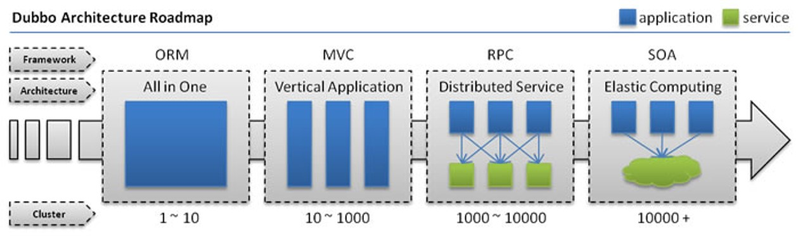

* **单一应用架构**

    当网站流量很小时，只需一个应用，将所有功能都部署在一起，以减少部署节点和成本。此时，用于简化增删改查工作量的数据访问框架(ORM)是关键。

* **垂直应用架构**

    当访问量逐渐增大，单一应用增加机器带来的加速度越来越小，将应用拆成互不相干的几个应用，以提升效率。此时，用于加速前端页面开发的Web框架(MVC)是关键。

* **分布式服务架构**

    当垂直应用越来越多，应用之间交互不可避免，将核心业务抽取出来，作为独立的服务，逐渐形成稳定的服务中心，使前端应用能更快速的响应多变的市场需求。此时，用于提高业务复用及整合的分布式服务框架(RPC)是关键。

* **流动计算架构**

    当服务越来越多，容量的评估，小服务资源的浪费等问题逐渐显现，此时需增加一个调度中心基于访问压力实时管理集群容量，提高集群利用率。此时，用于提高机器利用率的资源调度和治理中心(SOA)是关键。

## 2. Zookeeper和Dubbo

* **ZooKeeper**

    ZooKeeper 是一个分布式的，开放源码的分布式应用程序协调服务。它是一个为分布式应用提供一致性服务的软件，提供的功能包括：配置维护、域名服务、分布式同步、组服务等。

* **Dubbo**

    Dubbo是Alibaba开源的分布式服务框架，它最大的特点是按照分层的方式来架构，使用这种方式可以使各个层之间解耦合（或者最大限度地松耦合）。从服务模型的角度来看，Dubbo采用的是一种非常简单的模型，要么是提供方提供服务，要么是消费方消费服务，所以基于这一点可以抽象出服务提供方（Provider）和服务消费方（Consumer）两个角色。

    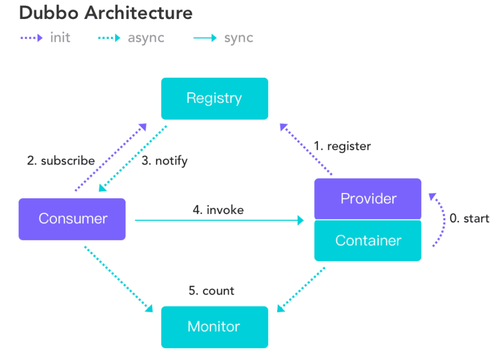

    整合步骤：

    1. 安装zookeeper作为注册中心

        ```shell
    docker pull zookeeper
         docker run --name zookeeper01 -p 2181:2181 --restart always -d zookeeper
        ```
        
    2. 编写服务提供者
    
        ```java
        @EnableDubbo
            /*************************/
            
            @Service  //org.apache.dubbo.config.annotation.Service;
            @Component
            public class TicketServiceImpl implements TicketService {
            
                @Override
                public String getTicket(Integer money) {
                    return "唐人街探案3";
                }
            }
        ```
    3. 编写服务消费者
    
        ```java
        @EnableDubbo
        /*************************/
        
        @Service  //org.springframework.stereotype.Service;
        public class UserService {
        
            @Reference  //org.apache.dubbo.config.annotation.Reference;
            TicketService ticketService;
        
            public String butTicket(Integer money){
                return ticketService.getTicket(money);
            }
        }
        ```
    
    4. 整合dubbo

## 3. Spring Boot和Spring Cloud

1. **Spring Cloud**

    Spring Cloud是一个分布式的整体解决方案。Spring Cloud 为开发者提供了**在分布式系统（配置管理，服务发现，熔断，路由，微代理，控制总线，一次性token，全局琐，leader选举，分布式session，集群状态）中快速构建的工具**，使用Spring Cloud的开发者可以快速的启动服务或构建应用、同时能够快速和云平台资源进行对接。

2. **SpringCloud分布式开发五大常用组件**

    * 服务发现——Netflix Eureka

    * 客服端负载均衡——Netflix Ribbon

    * 断路器——Netflix Hystrix

    * 服务网关——Netflix Zuul

    * 分布式配置——Spring Cloud Config

3. **微服务**

    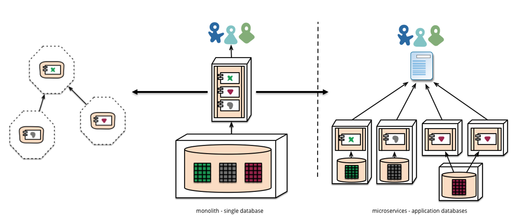

    **[Martin Fowler](https://martinfowler.com/)** **微服务[原文](https://martinfowler.com/articles/microservices.html)**

Spring Cloud 整合入门

1. 创建eureka

    ```yaml
    server:
      port: 8761
    eureka:
      instance:
        hostname: eureka-server  #eureka主机名
      client:
        register-with-eureka: false  #不将自身注册到eureka上
        fetch-registry: false  #不从eureka上获取服务的注册信息
        service-url:
          defaultZone: http://localhost:8761/eureka/
          
    #********** @EnableEurekaServer 开启注释  **********#
    ```

2. 创建provider

    ```java
    @Controller
    public class TicketContoller {
    
        @Autowired
        TicketService ticketService;
    
        @RequestMapping("/getTicket")
        @ResponseBody
        public String getTicket(Integer money){
            return ticketService.getTicket(money);
        }
    }
    ```

    ```yaml
    server:
      port: 8088
    eureka:
      instance:
        prefer-ip-address: true  # 使用ip方式读入
      client:
        service-url:
          defaultZone: http://localhost:8761/eureka/
    spring:
      application:
        name: provider-ticket
    ```

3. 创建consumer

    ```java
    @EnableDiscoveryClient
    /******************************/
    @RestController
    public class UserController {
    
        @Autowired
        RestTemplate restTemplate;
    
        @GetMapping("/buy")
        public String buyTicket(Integer money,String name){
            String s = restTemplate.getForObject("http://PROVIDER-TICKET/getTicket?money="+money, String.class);
            return name+"购买 "+s;
        }
    }
    ```

    

4. 引入Spring Cloud

    客服端

    ```xml
     <dependency>
         <groupId>org.springframework.cloud</groupId>
         <artifactId>spring-cloud-starter-netflix-eureka-client</artifactId>
    </dependency>
    ```

    服务端

    ```xml
    <dependency>
                <groupId>org.springframework.cloud</groupId>
                <artifactId>spring-cloud-starter-netflix-eureka-server</artifactId>
            </dependency>
    ```

5. 引入Eureka注册中心

    ```yaml
    eureka:
      instance:
        prefer-ip-address: true  # 使用ip方式读入
      client:
        service-url:
          defaultZone: http://localhost:8761/eureka/
    server:
      port: 8200
    spring:
      application:
        name: consumer-ticket
    ```

6. 引入Ribbon进行客户端负载均衡

    ```java
    @SpringBootApplication
    @EnableDiscoveryClient
    public class ConsumerCloudApplication {
    
        public static void main(String[] args) {
            SpringApplication.run(ConsumerCloudApplication.class, args);
        }
    
        @LoadBalanced
        @Bean
        public RestTemplate restTemplate(){
            return new RestTemplate();
        }
    }
    ```

----

# Spring Boot与开发热部署

## 一. 热部署

在开发中我们修改一个Java文件后想看到效果不得不重启应用，这导致大量时间花费，我们希望不重启应用的情况下，程序可以自动部署（热部署）。有以下四种情况，如何能实现热部署。

1. 模板引擎

    * 在Spring Boot中开发情况下禁用模板引擎的cache
    * 页面模板改变ctrl+F9可以重新编译当前页面并生效

2. Spring Loaded

    Spring官方提供的热部署程序，实现修改类文件的热部署

    * 下载Spring Loaded（项目地址https://github.com/spring-projects/spring-loaded）

    * 添加运行时参数

        `-javaagent:C:/springloaded-1.2.5.RELEASE.jar * noverify`

3. JRebel

    * 收费的一个热部署软件
    * 安装插件使用即可

4. Spring Boot Devtools（推荐）

    * 引入依赖
    
    ``` xml
    <dependency>  
           <groupId>org.springframework.boot</groupId>  
           <artifactId>spring-boot-devtools</artifactId>   
    </dependency> 
    ```
    
    * IDEA使用ctrl+F9
    
    * 或做一些小调整
    
         *Intellij IEDA**和**Eclipse**不同，**Eclipse**设置了自动编译之后，修改类它会自动编译，而**IDEA**在非**RUN**或**DEBUG**情况下才会自动编译（前提是你已经设置了**Auto-Compile**）。*
    
        * 设置自动编译（settings-compiler-make project automatically）
        * ctrl+shift+alt+/（maintenance）
        * 勾选compiler.automake.allow.when.app.running


---

# Spring Boot与监控管理

## 一. 监控管理

通过引入spring-boot-starter-actuator，可以使用Spring Boot为我们提供的准生产环境下的应用监控和管理功能。我们可以通过HTTP，JMX，SSH协议来进行操作，自动得到审计、健康及指标信息等

**步骤：**

* 引入spring-boot-starter-actuator
* 通过http方式访问监控端点
* 可进行shutdown（POST 提交，此端点默认关闭）


**监控和管理端点**

| **端点名**   | **描述**                    |
| ------------ | --------------------------- |
| *autoconfig* | 所有自动配置信息            |
| auditevents  | 审计事件                    |
| beans        | 所有Bean的信息              |
| configprops  | 所有配置属性                |
| dump         | 线程状态信息                |
| env          | 当前环境信息                |
| health       | 应用健康状况                |
| info         | 当前应用信息                |
| metrics      | 应用的各项指标              |
| mappings     | 应用@RequestMapping映射路径 |
| shutdown     | 关闭当前应用（默认关闭）    |
| trace        | 追踪信息（最新的http请求）  |

## 二. 定制端点信息

* 定制端点一般通过endpoints+端点名+属性名来设置。
* 修改端点id（endpoints.beans.id=mybeans）
* 开启远程应用关闭功能（endpoints.shutdown.enabled=true）
* 关闭端点（endpoints.beans.enabled=false）
* 开启所需端点
    * endpoints.enabled=false
    * endpoints.beans.enabled=true
* 定制端点访问根路径
    * management.context-path=/manage
* 关闭http端点
    * management.port=-1
* 配置redis等后可以自动监测

## 三. Sring Boot Admin

1. 依赖

    Server

    ```xml
    <dependency>
      <groupId>de.codecentric</groupId>
      <artifactId>spring-boot-admin-starter-server</artifactId>
      <version>2.1.0</version>
    </dependency>
    ```

    Cilent

    ```xml
     <dependency>
        <groupId>de.codecentric</groupId>
        <artifactId>spring-boot-admin-starter-client</artifactId>
        <version>2.1.0</version>
      </dependency>
    ```

2. 配置

    Server

    ```yaml
    server:
    	port: 8000
    ```

    ```java
    @EnableAdminServer
    @SpringBootApplication
    public class AdminServerApplication {
    
      public static void main(String[] args) {
        SpringApplication.run(AdminServerApplication.class, args);
      }
    }
    ```

    Cilent

    ```yaml
    server: 
    	port: 8001
    spring:
    	application:
    		name: Admin Client
    	boot:
    		admin:
    			client:
    				url: http://localhost:8000   # 配置 Admin Server 的地址
    management:
    	endpoints:
    		web:
    			exposure:
    				include: *   # 打开客户端 Actuator 的监控
    ```

    