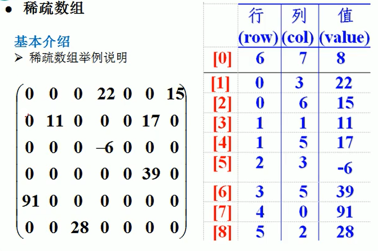
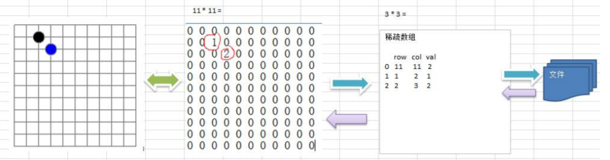

# 数据结构与算法

## 一. 稀疏数组和队列

> 基本介绍

当一个数组中大部分元素为０，或者为同一个值的数组时，可以使用稀疏数组来保存该数组。

> 稀疏数组的处理方法

* 记录数组一共有几行几列，有多少个不同的值

* 把具有不同值的元素的行列及值记录在一个小规模的数组中，从而缩小程序的规模

> 稀疏数组



> 思路分析



* 二维数组转稀疏数组思路
    1. 遍历原始二维数组，得到有效数据个数
    2. 更具sum创建稀疏数组 sparseArr int[sum+1\][3]
    3. 将二维数组有效数据存入到稀疏数组
* 稀疏数组转原始二维数组
    1. 根据稀疏数组创键二维数组
    2. 向二位数组中置入对应数值

> 代码实现

```java
package test.datastructure.sparsearray;

/**
 * TODO:
 *
 * @author Gao
 * date: 2020/6/10 16:51
 */
public class SparseArray {
    public static void main(String[] args) {
        // set chessArray
        int[][] chessArray = new int[10][10];
        chessArray[1][2] = 1;
        chessArray[2][3] = 2;
        // print chessArray
        for (int[] ints:chessArray){
            for (int anInt:ints){
                System.out.print(anInt+"  ");
            }
            System.out.println();
        }

        // set sparseArray
        int sum = 0;
        for (int[] ints : chessArray) {
            for (int anInt : ints) {
                if (anInt>0) {
                    sum++;
                }
            }
        }

        int[][] sparseArray = new int[sum+1][3];
        sparseArray[0][0] = chessArray.length;
        sparseArray[0][1] = chessArray[0].length;
        sparseArray[0][2] = sum;
        int count = 0;
        for (int i = 0; i < chessArray.length; i++) {
            for (int j = 0; j < chessArray[i].length; j++) {
                if (chessArray[i][j]>0) {
                    count++;
                    sparseArray[count][0] = i;
                    sparseArray[count][1] = j;
                    sparseArray[count][2] = chessArray[i][j];
                }
            }
        }
        // print sparseArray
        for (int[] ints : sparseArray) {
            for (int anInt : ints) {
                System.out.print(anInt+"  ");
            }
            System.out.println();
        }

    }
}

```

## 链表


## 栈

## 递归

## 排序算法

## 查找算法

## 哈希表

## 树结构基础

## 树结构实际

## 多路查找树

## 图

## 常用10种算法


