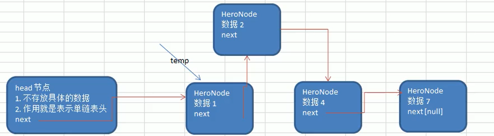
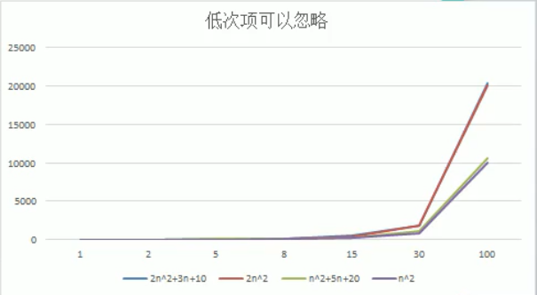

# 数据结构与算法

## 一. 稀疏数组和队列

### 1. 稀疏数组

> 基本介绍

当一个数组中大部分元素为０，或者为同一个值的数组时，可以使用稀疏数组来保存该数组。

> 稀疏数组的处理方法

* 记录数组一共有几行几列，有多少个不同的值

* 把具有不同值的元素的行列及值记录在一个小规模的数组中，从而缩小程序的规模

> 稀疏数组


> 思路分析


* 二维数组转稀疏数组思路
    1. 遍历原始二维数组，得到有效数据个数
    2. 更具sum创建稀疏数组 sparseArr int[sum+1\][3]
    3. 将二维数组有效数据存入到稀疏数组
* 稀疏数组转原始二维数组
    1. 根据稀疏数组创键二维数组
    2. 向二位数组中置入对应数值

> 代码实现

```java
package test.datastructure.sparsearray;

/**
 * TODO:
 *
 * @author Gao
 * date: 2020/6/10 16:51
 */
public class SparseArray {
    public static void main(String[] args) {
        // set chessArray
        int[][] chessArray = new int[10][10];
        chessArray[1][2] = 1;
        chessArray[2][3] = 2;
        // print chessArray
        for (int[] ints:chessArray){
            for (int anInt:ints){
                System.out.print(anInt+"  ");
            }
            System.out.println();
        }

        // set sparseArray
        int sum = 0;
        for (int[] ints : chessArray) {
            for (int anInt : ints) {
                if (anInt>0) {
                    sum++;
                }
            }
        }

        int[][] sparseArray = new int[sum+1][3];
        sparseArray[0][0] = chessArray.length;
        sparseArray[0][1] = chessArray[0].length;
        sparseArray[0][2] = sum;
        int count = 0;
        for (int i = 0; i < chessArray.length; i++) {
            for (int j = 0; j < chessArray[i].length; j++) {
                if (chessArray[i][j]>0) {
                    count++;
                    sparseArray[count][0] = i;
                    sparseArray[count][1] = j;
                    sparseArray[count][2] = chessArray[i][j];
                }
            }
        }
        // print sparseArray
        for (int[] ints : sparseArray) {
            for (int anInt : ints) {
                System.out.print(anInt+"  ");
            }
            System.out.println();
        }

    }
}

```

### 2. 队列

> 队列介绍

* 队列是一个有序列表，可以用数组或是链表来实现。

* 遵循先入先出的原则。即：先存入队列的数据，要先取出。后存入的要后取出。

*  示意图：(使用数组模拟队列示意图)

    

>  数组模拟队列思路

* 队列本身是有序列表，若使用数组的结构来存储队列的数据，则队列数组的声明如下图, 其中 maxSize 是该队 列的最大容量。

* 因为队列的输出、输入是分别从前后端来处理，因此需要两个变量 front 及 rear 分别记录队列前后端的下标， front 会随着数据输出而改变，而 rear 则是随着数据输入而改变。

* 当我们将数据存入队列时称为”addQueue”，addQueue 的处理需要有两个步骤：

    1. 将尾指针往后移：rear+1 , 当 front == rear [null]
    2.  若尾指针 rear 小于队列的最大下标 maxSize-1，则将数据存入 rear 所指的数组元素中，否则无法存入数据。 rear == maxSize - 1[队列满]

* 代码实现

    ```java
    /**
     * 使用数组模拟队列-编写一个 ArrayQueue 类
     */
    
    class ArrayQueue {
        private int maxSize;
        // 队列头
        private int front;
        // 队列尾
        private int rear;
        private int[] arr;
    
        public ArrayQueue(int maxSize){
            this.maxSize = maxSize;
            this.front = -1;
            this.rear = -1;
            arr = new int[maxSize];
        }
        public boolean isFull(){
            return rear==maxSize-1;
        }
        public boolean isEmpty(){
           return rear==front;
        }
        public void addQueue(int n){
            if (isFull()) {
                System.out.println("队列满，不能加入数据~");
                return;
            }
            rear++; // 让 rear 后移
            arr[rear] = n;
        }
    
        public int getQueue() {
            if (isEmpty()) {
                System.out.println("队列空，不能取数据");
            }
            front++;
            return arr[front];
        }
    
        public void showQueue() {
            if (isEmpty()) {
                System.out.println("队列空的，没有数据~~");
                return;
            }
            for (int i = 0; i < arr.length; i++) {
                System.out.printf("arr[%d]=%d\n", i, arr[i]);
            }
        }
    
        public int headQueue() {
            if (isEmpty()) {
                System.out.println("队列空的，没有数据~~");
            }
            return arr[front + 1];
        }
    }
    ```

    **注意：这类数组使用一次就不能用， 没有达到复用的效果。**

> 数组模拟环形队列

* 条件

    * 尾索引的下一个为头索引时表示队列满，即将队列容量空出一个作为约定,这个在做判断队列满的 时候需要注意 (rear + 1) % maxSize == front    [full] 
    * rear == front   [null]
    * 环形队列会预留一个位置，用于环接

* 代码实现

    ```java
    class ArrayQueue {
        private int maxSize;
        // 队列头
        private int front;
        // 队列尾
        private int rear;
        private int[] arr;
    
        public ArrayQueue(int maxSize){
            this.maxSize = maxSize;
            this.front = 0;
            this.rear = 0;
            arr = new int[maxSize];
        }
        public boolean isFull(){
            return (rear+1)%maxSize==front;
        }
        public boolean isEmpty(){
           return rear==front;
        }
        public void addQueue(int n){
            if (isFull()) {
                System.out.println("队列满，不能加入数据~");
                return;
            }
            arr[rear] = n;
            rear=(rear+1)%maxSize;
        }
    
        public int getQueue() {
            if (isEmpty()) {
                throw new RuntimeException("队列空，不能取数据");
            }
            int result = arr[front];
            front = (front+1)%maxSize;
            return result;
        }
    
        public void showQueue() {
            if (isEmpty()) {
                System.out.println("队列空的，没有数据~~");
                return;
            }
            for (int i = 0; i < arr.length; i++) {
                System.out.printf("arr[%d]=%d\n", i, arr[i]);
            }
        }
    
        public int headQueue() {
            if (isEmpty()) {
                System.out.println("队列空的，没有数据~~");
            }
            return arr[front + 1];
        }
    }
    ```

## 二. 链表

### 1. 单链表

> 链表(Linked List)介绍

链表是有序的列表，但是它在内存中是存储如下:


1. 链表是以节点的方式来存储,是链式存储。

2. 每个节点包含 data 域， next 域：指向下一个节点。

3. 如图：发现链表的各个节点不一定是连续存储。

4. 链表分带头节点的链表和没有头节点的链表，根据实际的需求来确定

5. 单链表(带头结点) 逻辑结构示意图如下：

    

> 单链表的应用实例


* 添加（创建）

    1. 先创建一个head头节点，作用就是表示单链表的头
    2. 后面我们每添加一个节点，就直接加入到链表的最后

* 遍历

    1. 通过一个辅助遍历，帮助遍历整个链表

    

* 需要按照编号的顺序添加

    1. 首先找到新添加的节点的位置，是通过辅助变量（指针）
    2. 新的节点.next=temp.next 
    3. 将temp.next=新的节点

    

* 从单链表中删除一个节点的思路

    1. 先找到需要删除的这个节点的前一个节点temp
    2. temp.next=temp.next.next
    3. 被删除的节点，将不会有其它引用指向，会被垃圾回收机制回收

* 代码

    ```java
    class SingleLinkedList {
    	//先初始化一个头节点, 头节点不要动, 不存放具体的数据
    	private HeroNode head = new HeroNode(0, "", "");
    	
    	//返回头节点
    	public HeroNode getHead() {
    		return head;
    	}
    
    	//添加节点到单向链表
    	//思路，当不考虑编号顺序时
    	//1. 找到当前链表的最后节点
    	//2. 将最后这个节点的next 指向 新的节点
    	public void add(HeroNode heroNode) {
    		
    		//因为head节点不能动，因此我们需要一个辅助遍历 temp
    		HeroNode temp = head;
    		//遍历链表，找到最后
    		while(true) {
    			//找到链表的最后
    			if(temp.next == null) {//
    				break;
    			}
    			//如果没有找到最后, 将将temp后移
    			temp = temp.next;
    		}
    		//当退出while循环时，temp就指向了链表的最后
    		//将最后这个节点的next 指向 新的节点
    		temp.next = heroNode;
    	}
    	
    	//第二种方式在添加英雄时，根据排名将英雄插入到指定位置
    	//(如果有这个排名，则添加失败，并给出提示)
    	public void addByOrder(HeroNode heroNode) {
    		//因为头节点不能动，因此我们仍然通过一个辅助指针(变量)来帮助找到添加的位置
    		//因为单链表，因为我们找的temp 是位于 添加位置的前一个节点，否则插入不了
    		HeroNode temp = head;
    		boolean flag = false; // flag标志添加的编号是否存在，默认为false
    		while(true) {
    			if(temp.next == null) {//说明temp已经在链表的最后
    				break; //
    			} 
    			if(temp.next.no > heroNode.no) { //位置找到，就在temp的后面插入
    				break;
    			} else if (temp.next.no == heroNode.no) {//说明希望添加的heroNode的编号已然存在
    				
    				flag = true; //说明编号存在
    				break;
    			}
    			temp = temp.next; //后移，遍历当前链表
    		}
    		//判断flag 的值
    		if(flag) { //不能添加，说明编号存在
    			System.out.printf("准备插入的英雄的编号 %d 已经存在了, 不能加入\n", heroNode.no);
    		} else {
    			//插入到链表中, temp的后面
    			heroNode.next = temp.next;
    			temp.next = heroNode;
    		}
    	}
    
    	//修改节点的信息, 根据no编号来修改，即no编号不能改.
    	//说明
    	//1. 根据 newHeroNode 的 no 来修改即可
    	public void update(HeroNode newHeroNode) {
    		//判断是否空
    		if(head.next == null) {
    			System.out.println("链表为空~");
    			return;
    		}
    		//找到需要修改的节点, 根据no编号
    		//定义一个辅助变量
    		HeroNode temp = head.next;
    		boolean flag = false; //表示是否找到该节点
    		while(true) {
    			if (temp == null) {
    				break; //已经遍历完链表
    			}
    			if(temp.no == newHeroNode.no) {
    				//找到
    				flag = true;
    				break;
    			}
    			temp = temp.next;
    		}
    		//根据flag 判断是否找到要修改的节点
    		if(flag) {
    			temp.name = newHeroNode.name;
    			temp.nickname = newHeroNode.nickname;
    		} else { //没有找到
    			System.out.printf("没有找到 编号 %d 的节点，不能修改\n", newHeroNode.no);
    		}
    	}
    	
    	//删除节点
    	//思路
    	//1. head 不能动，因此我们需要一个temp辅助节点找到待删除节点的前一个节点
    	//2. 说明我们在比较时，是temp.next.no 和  需要删除的节点的no比较
    	public void del(int no) {
    		HeroNode temp = head;
    		boolean flag = false; // 标志是否找到待删除节点的
    		while(true) {
    			if(temp.next == null) { //已经到链表的最后
    				break;
    			}
    			if(temp.next.no == no) {
    				//找到的待删除节点的前一个节点temp
    				flag = true;
    				break;
    			}
    			temp = temp.next; //temp后移，遍历
    		}
    		//判断flag
    		if(flag) { //找到
    			//可以删除
    			temp.next = temp.next.next;
    		}else {
    			System.out.printf("要删除的 %d 节点不存在\n", no);
    		}
    	}
    	
    	//显示链表[遍历]
    	public void list() {
    		//判断链表是否为空
    		if(head.next == null) {
    			System.out.println("链表为空");
    			return;
    		}
    		//因为头节点，不能动，因此我们需要一个辅助变量来遍历
    		HeroNode temp = head.next;
    		while(true) {
    			//判断是否到链表最后
    			if(temp == null) {
    				break;
    			}
    			//输出节点的信息
    			System.out.println(temp);
    			//将temp后移， 一定小心
    			temp = temp.next;
    		}
    	}
    }
    
    //定义HeroNode ， 每个HeroNode 对象就是一个节点
    class HeroNode {
    	public int no;
    	public String name;
    	public String nickname;
    	public HeroNode next; //指向下一个节点
    	//构造器
    	public HeroNode(int no, String name, String nickname) {
    		this.no = no;
    		this.name = name;
    		this.nickname = nickname;
    	}
    	//为了显示方法，我们重新toString
    	@Override
    	public String toString() {
    		return "HeroNode [no=" + no + ", name=" + name + ", nickname=" + nickname + "]";
    	}
    	
    }
    ```


> 单链表面试题

```java
//方法：获取到单链表的节点的个数(如果是带头结点的链表，需求不统计头节点)
/**
	 * 
	 * @param head 链表的头节点
	 * @return 返回的就是有效节点的个数
	 */
public static int getLength(HeroNode head) {
    if(head.next == null) { //空链表
        return 0;
    }
    int length = 0;
    //定义一个辅助的变量, 这里我们没有统计头节点
    HeroNode cur = head.next;
    while(cur != null) {
        length++;
        cur = cur.next; //遍历
    }
    return length;
}

//查找单链表中的倒数第k个结点 【新浪面试题】
//思路
//1. 编写一个方法，接收head节点，同时接收一个index 
//2. index 表示是倒数第index个节点
//3. 先把链表从头到尾遍历，得到链表的总的长度 getLength
//4. 得到size 后，我们从链表的第一个开始遍历 (size-index)个，就可以得到
//5. 如果找到了，则返回该节点，否则返回nulll
public static HeroNode findLastIndexNode(HeroNode head, int index) {
    //判断如果链表为空，返回null
    if(head.next == null) {
        return null;//没有找到
    }
    //第一个遍历得到链表的长度(节点个数)
    int size = getLength(head);
    //第二次遍历  size-index 位置，就是我们倒数的第K个节点
    //先做一个index的校验
    if(index <=0 || index > size) {
        return null; 
    }
    //定义给辅助变量， for 循环定位到倒数的index
    HeroNode cur = head.next; //3 // 3 - 1 = 2
    for(int i =0; i< size - index; i++) {
        cur = cur.next;
    }
    return cur;

}

//将单链表反转
public static void reversetList(HeroNode head) {
    //如果当前链表为空，或者只有一个节点，无需反转，直接返回
    if(head.next == null || head.next.next == null) {
        return ;
    }

    //定义一个辅助的指针(变量)，帮助我们遍历原来的链表
    HeroNode cur = head.next;
    HeroNode next = null;// 指向当前节点[cur]的下一个节点
    HeroNode reverseHead = new HeroNode(0, "", "");
    //遍历原来的链表，每遍历一个节点，就将其取出，并放在新的链表reverseHead 的最前端
    //动脑筋
    while(cur != null) { 
        next = cur.next;//先暂时保存当前节点的下一个节点，因为后面需要使用
        cur.next = reverseHead.next;//将cur的下一个节点指向新的链表的最前端
        reverseHead.next = cur; //将cur 连接到新的链表上
        cur = next;//让cur后移
    }
    //将head.next 指向 reverseHead.next , 实现单链表的反转
    head.next = reverseHead.next;
}

//可以利用栈这个数据结构，将各个节点压入到栈中，然后利用栈的先进后出的特点，就实现了逆序打印的效果
public static void reversePrint(HeroNode head) {
    if(head.next == null) {
        return;//空链表，不能打印
    }
    //创建要给一个栈，将各个节点压入栈
    Stack<HeroNode> stack = new Stack<HeroNode>();
    HeroNode cur = head.next;
    //将链表的所有节点压入栈
    while(cur != null) {
        stack.push(cur);
        cur = cur.next; //cur后移，这样就可以压入下一个节点
    }
    //将栈中的节点进行打印,pop 出栈
    while (stack.size() > 0) {
        System.out.println(stack.pop()); //stack的特点是先进后出
    }
}
```

### 2. 双向链表

> 双向链表的操作分析和实现


* 遍历 
    * 方和 单链表一样，只是可以向前，也可以向后查找
* **添加** (默认添加到双向链表的最后)
    1. 先找到双向链表的最后这个节点
    2. temp.next = newHeroNode
    3. newHeroNode.pre = temp; 
* **修改** 
    * 思路和 原来的单向链表一样. 
* **删除**
    1. 因为是双向链表，因此，我们可以实现自我删除某个节点 
    2. 直接找到要删除的这个节点，比如 temp
    3. temp.pre.next = temp.next
    4. temp.next.pre = temp.pre

## 三. 栈

### 1. 栈

> 栈的介绍 

* 栈的英文为(stack)

* 栈是一个**先入后出**(FILO-First In Last Out)的有序列表。

* 栈(stack)是**限制线性表**中元素的插入和删除只能在线性表的同一端进行的一种特殊线性表。允许插入和删除的 一端，为**变化的一端，称为栈顶**(Top)，另一端为**固定的一端，称为栈底**(Bottom)。

* 根据栈的定义可知，最先放入栈中元素在栈底，最后放入的元素在栈顶，而删除元素刚好相反，最后放入的元 素最先删除，最先放入的元素最后删除

*  图解方式说明出栈(pop)和入栈(push)的概念

    

> 栈的应用场景

1. 子程序的调用：在跳往子程序前，会先将下个指令的地址存到堆栈中，直到子程序执行完后再将地址取出，以 回到原来的程序中。
2. 处理递归调用：和子程序的调用类似，只是除了储存下一个指令的地址外，也将参数、区域变量等数据存入堆 栈中。
3. 表达式的转换[中缀表达式转后缀表达式]与求值(实际解决)。
4. 二叉树的遍历。
5. 图形的深度优先(depth 一 first)搜索法。

> 栈的实现

**实现栈的思路分析**

1. 使用数组来模拟栈
2. 定义一个top来表示栈顶，初始化为-1
3. 入栈的操作，当有数据加入到栈时，top+t;stack[top]=data;
4. 出栈的操作，int value=stack[top];top--,return valuel

```java
/**
 *  定义一个 ArrayStack 表示栈
 */
class ArrayStack{
    private int maxSize;
    private int[] stack;
    private int top = -1;

    public ArrayStack(int maxSize) {
        this.maxSize = maxSize;
        stack = new int[this.maxSize];
    }

    public boolean isFull(){
        return top == maxSize-1;
    }

    public boolean isEmpty(){
        return top == -1;
    }

    public void push(int value){
        if (isFull()) {
            throw  new RuntimeException("Stack is Full!");
        }
        top++;
        stack[top] = value;
    }

    public int pop(){
        if (isEmpty()) {
            throw new RuntimeException("Stack is Empty!");
        }
        return stack[top--];
    }

    //显示栈的情况[遍历栈]， 遍历时，需要从栈顶开始显示数据
    public void list() {
        if(isEmpty()) {
            System.out.println("栈空，没有数据~~");
            return;
        }
        //需要从栈顶开始显示数据
        for(int i = top; i >= 0 ; i--) {
            System.out.printf("stack[%d]=%d\n", i, stack[i]);
        }
    }
}
```


## 四. 递归

### 1. 递归基础

> 递归的概念

​	递归就是方法自己调用自己,每次调用时传入不同的变量.递归有助于编程者解决复杂的问题,同时 可以让代码变得简洁。

> 递归调用机制


1. 当程序执行到一个方法时，就会开辟一个独立的空间（栈）。
2. 每个空间的数据（局部变量）,是独立的。

### 2. 递归-八皇后问题(回溯算法)

> 八皇后问题介绍 

​	八皇后问题，是一个古老而著名的问题，是回溯算法的典型案例。该问题是国际西洋棋棋手马克斯·贝瑟尔于 1848 年提出：在 8×8 格的国际象棋上摆放八个皇后，使其不能互相攻击，即：任意两个皇后都不能处于同一行、 同一列或同一斜线上，问有多少种摆法(92)。

> 八皇后问题算法思路分析

1. 第一个皇后先放第一行第一列
2. 第二个皇后放在第二行第一列、然后判断是否 OK， 如果不 OK，继续放在第二列、第三列、依次把所有列都 放完，找到一个合适
3. 继续第三个皇后，还是第一列、第二列……直到第 8 个皇后也能放在一个不冲突的位置，算是找到了一个正确解
4. 当得到一个正确解时，在栈回退到上一个栈时，就会开始回溯，即将第一个皇后，放到第一列的所有正确解， 全部得到
5. 然后回头继续第一个皇后放第二列，后面继续循环执行 1,2,3,4 的步骤

> 回溯法

```java
public class Queue8 {
    int max = 8;
    int[] array = new int[max];
    int num = 0;

    public static void main(String[] args) {
        Queue8 queue8 = new Queue8();
        queue8.check(0);
        System.out.println("一共有"+queue8.num+"种");
    }

    private void check(int n){

        if(n==max){
            print();
            return;
        }
        for (int i = 0; i < max; i++) {
            array[n]=i;
            if(judge(n)){
                check(n+1);
            }
        }
    }

    /**
     * 判断棋子正确性
     */
    private boolean judge(int n){
        for (int i = 0; i < n; i++) {
            if(array[i] == array[n] || Math.abs(n-i) == Math.abs(array[n]-array[i])){
                return false;
            }
        }
        return true;
    }

    /**
     * 打印棋盘
     */
    private void print(){
        int add = 1;
        num++;
        for (int i : array) {
            System.out.print((add++)+":"+i+"  ");
        }
        System.out.println();
    }
}
```


## 五. 排序算法

> 排序算法的介绍 

​	排序也称排序算法(Sort Algorithm)，排序是将一组数据，依指定的顺序进行排列的过程。

> 排序的分类

1. **内部排序**: 指将需要处理的所有数据都加载到内部存储器(内存)中进行排序。
2. **外部排序法**： 数据量过大，无法全部加载到内存中，需要借助外部存储(文件等)进行排序。
3. 常见的排序算法分类:


### 1.  算法的时间复杂度

> 1.1 度量一个程序(算法)执行时间的两种方法

1. 事后统计的方法 

    这种方法可行, 但是有两个问题：一是要想对设计的算法的运行性能进行评测，需要实际运行该程序；二是所 得时间的统计量依赖于计算机的硬件、软件等环境因素, 这种方式，要在同一台计算机的相同状态下运行，才能比较那个算法速度更快。

2. 事前估算的方法 

    通过分析某个算法的时间复杂度来判断哪个算法更优。

> 1.2 时间频度

* 基本介绍 

    时间频度：一个算法花费的时间与算法中语句的执行次数成正比例，哪个算法中语句执行次数多，它花费时间 就多。**一个算法中的语句执行次数称为语句频度或时间频度**。记为 T(n)。

* 忽略常数项

    

* 忽略低次项

    

* 忽略系数

    

> 1.3 时间复杂度计算方法

* 用常数 1 代替运行时间中的所有加法常数 T(n)=n²+7n+6 => T(n)=n²+7n+1
* 修改后的运行次数函数中，只保留最高阶项 T(n)=n²+7n+1 => T(n) = n²
* 去除最高阶项的系数 T(n) = n² => T(n) = n² => O(n²) 

> 1.4 常见的时间复杂度

1. 常数阶 O(1)
2. 对数阶 O(log2n)
3. 线性阶 O(n)
4. 线性对数阶 O(nlog2n)平方阶 O(n^2) 
5. 立方阶 O(n^3)
6. k 次方阶 O(n^k)
7. 指数阶 O(2^n) 

**常见的时间复杂度对应的图**:


​		常见的算法时间复杂度由小到大依次为：Ο(1)＜Ο(log2n)＜Ο(n)＜Ο(nlog2n)＜Ο(n2)＜Ο(n3)＜ Ο(nk) ＜ Ο(2n) ，随着问题规模 n 的不断增大，上述时间复杂度不断增大，算法的执行效率越低。

> 1.5 平均时间复杂度和最坏时间复杂度

1. 平均时间复杂度是指所有可能的输入实例均以等概率出现的情况下，该算法的运行时间。

2. 最坏情况下的时间复杂度称最坏时间复杂度**。一般讨论的时间复杂度均是最坏情况下的时间复杂度**。

    最坏情况下的时间复杂度是算法在任何输入实例上运行时间的界限，这就保证了算法的运行时间不会 比最坏情况更长。

3. 平均时间复杂度和最坏时间复杂度是否一致，和算法有关

    | 排序法 | 平均时间   | 最差情形      | 稳定度 | 额外空间 | 备注                          |
    | ------ | ---------- | ------------- | ------ | -------- | ----------------------------- |
    | 冒泡   | O(n^2^)    | O(n^2^)       | 稳定   | O(1)     | n小时较好                     |
    | 选择   | O(n^2^)    | O(n^2^)       | 不稳定 | O(1)     | n小时较好                     |
    | 插入   | O(n^2^)    | O(n^2^)       | 稳定   | O(1)     | 大部分已排序时较好            |
    | 基数   | O(log~R~B) | O(log~R~B)    | 稳定   | O(n)     | B是真数(0-9)，R是基数(个十百) |
    | Shell  | O(nlogn)   | O(n^s^) 1<s<2 | 不稳定 | O(1)     | s是所选分组                   |
    | 快速   | O(nlogn)   | O(n^2^)       | 不稳定 | O(nlogn) | n大时较好                     |
    | 归并   | O(nlogn)   | O(nlogn)      | 稳定   | O(1)     | n大时较好                     |
    | 堆     | O(nlogn)   | O(nlogn)      | 不稳定 | O(1)     | n大时较好                     |

### 2. 算法的空间复杂度

> 2.1 基本介绍

1. 类似于时间复杂度的讨论，一个算法的空间复杂度(Space Complexity)定义为该算法所耗费的存储空间，它也是 问题规模 n 的函数。
2. 空间复杂度(Space Complexity)是对一个算法在运行过程中临时占用存储空间大小的量度。有的算法需要占用的临时工作单元数与解决问题的规模 n 有关，它随着 n 的增大而增大，当 n 较大时，将占用较多的存储单元，例如快速排序和**归并排序算法, 基数排序**就属于这种情况
3. 在做算法分析时，主要讨论的是时间复杂度。**从用户使用体验上看，更看重的程序执行的速度**。一些缓存产品 (redis, memcache)和算法(基数排序)**本质就是用空间换时间**.

### 3. 冒泡排序

> 3.1 基本介绍

​		冒泡排序（Bubble Sorting）的基本思想是：通过对待排序序列从前向后（从下标较小的元素开始）,**依次比较相邻元素的值，若发现逆序则交换**，使值较大的元素逐渐从前移向后部，就象水底下的气泡一样逐渐向上冒。

​		**优化**： 因为排序的过程中，各元素不断接近自己的位置，**如果一趟比较下来没有进行过交换，就说明序列有序**，因此要在 排序过程中设置一个标志 flag 判断元素是否进行过交换。从而减少不必要的比较。(这里说的优化，可以在冒泡排 序写好后，在进行)

> 3.2 实现代码

```java
public class BubbleSort {
    public static int[] sort(int[] arr) {
        // 冒泡排序 的时间复杂度 O(n^2), 自己写出
        int temp = 0;
        // 标识变量，表示是否进行过交换
        boolean flag = false;
        for (int i = 0; i < arr.length - 1; i++) {
            for (int j = 0; j < arr.length - 1 - i; j++) {
                // 如果前面的数比后面的数大，则交换
                if (arr[j] > arr[j + 1]) {
                    flag = true;
                }
                temp = arr[j];
                arr[j] = arr[j + 1];
                arr[j + 1] = temp;
            }
            if (!flag) {
                // 在一趟排序中，一次交换都没有发生过
                break;
            } else {
                // 重置 flag!!!, 进行下次判断
                flag = false;
            }
        }
        return arr;
    }
}
```

### 4. 选择排序

> 4.1 基本介绍

 		选择式排序也属于**内部排序法**，是从欲排序的数据中，按指定的规则选出某一元素，再**依规定交换位置后达到**排序的目的。

> 4.2 选择排序思想

​		选择排序（select sorting）也是一种简单的排序方法。它的基本思想是：第一次从 arr[0]~arr[n-1]中选取最小值， 与 arr[0]交换，第二次从 arr[1]~arr[n-1]中选取最小值，与 arr[1]交换，第三次从 arr[2]~arr[n-1]中选取最小值，与 arr[2] 交换，…，第 i 次从 arr[i-1]~arr[n-1]中选取最小值，与 arr[i-1]交换，…, 第 n-1 次从 arr[n-2]~arr[n-1]中选取最小值， 与 arr[n-2]交换，总共通过 n-1 次，得到一个按排序码从小到大排列的有序序列。

> 4.3 选择排序思路分析图


> 4.4 选择排序关键代码

```java
public class SelectSort {
    public static int[] sort(int[] ar) {
        int min,minIndex;
        int[] arr = new int[ar.length];
        System.arraycopy(ar,0,arr,0,arr.length);
        for (int i = 0; i < arr.length; i++) {
            minIndex = i;
            for (int j = i+1; j < arr.length; j++) {
                if (arr[j] < arr[minIndex]) {
                    minIndex = j;
                }
            } 
            if (minIndex != i) {
                min = arr[minIndex];
                arr[minIndex] = arr[i];
                arr[i] = min;
            }
        }
        return ar;
    }
}
```

### 5. 插入排序

> 5.1 插入排序法介绍

​		插入式排序属于**内部排序法**，是对于欲排序的元素**以插入的方式**找寻该元素的**适当位置**，以达到排序的目的。

> 5.2 插入排序法思想

​		插入排序（Insertion Sorting）的基本思想是：**把 n 个待排序的元素看成为一个有序表和一个无序表**，开始时有 序表中**只包含一个元素，**无序表中包含有 **n-1 个元素**，排序过程中每次从无序表中取出第一个元素，把它的排 序码依次与有序表元素的排序码进行比较，将它插入到有序表中的适当位置，使之成为新的有序表。

> 5.3 插入排序思路图


> 5.4 插入排序关键代码

```java
public class InsertSort {
    public static int[] sort(int[] ar) {
        int[] arr = new int[ar.length];
        System.arraycopy(ar, 0, arr, 0, arr.length);
        int insertVal;
        int insertIndex ;
        for (int i = 1; i < arr.length; i++) {
            insertVal = arr[i];
            insertIndex = i - 1;
            //反向遍历数组后移
            while (insertIndex >= 0 && insertVal < arr[insertIndex]) {
                arr[insertIndex + 1] = arr[insertIndex];
                insertIndex--;
            }
            if (insertIndex + 1 == i) {
                arr[insertIndex + 1] = insertVal;
            }
        }
        return arr;
    }
}
```

* 当需要插入的数是**较小的数**时，后移的**次数明显增多**，**对效率有影响**

### 6. 希尔排序

> 6.1 希尔排序法介绍

 		希尔排序是希尔（Donald Shell）于 1959 年提出的一种排序算法。希尔排序也是一种**插入排序**，它是简单插入排序经过**改进之后的一个更高效的版本**，也称为**缩小增量排序**。

> 6.2 希尔排序法基本思想

 		希尔排序是把记录按下标的一定增量分组，对每组使用直接插入排序算法排序；随着增量逐渐减少，每组包含 的关键词越来越多，当**增量减至 1** 时，整个文件恰被分成一组，算法便终止。

> 6.3 希尔排序法的示意图


> 6.4 希尔排序代码实现

1. 交换法    希尔+选择

    ```java
    public static int[] sortChange(int[] ar) {
            int[] arr = new int[ar.length];
            System.arraycopy(ar,0,arr,0,arr.length);
            int temp = 0;
            // 获取步长
            for (int gap = arr.length>>1; gap > 0; gap>>=1) {
                for (int i = gap; i < arr.length; i++) {
                    
                    for (int j = i-gap; j >=0 ; j-=gap) {
                        if (arr[j] > arr[j + gap]) {
                            temp=arr[j];
                            arr[j] = arr[j + gap];
                            arr[j + gap] = temp;
                        }
                    }
                }
            }
            return arr;
        }
    ```

2. 移动法    希尔+插入

    ```java
    public static int[] sortMove(int[] ar) {
            int[] arr = new int[ar.length];
            System.arraycopy(ar,0,arr,0,arr.length);
            int temp = 0;
            // 获取步长
            for (int gap = arr.length>>1; gap > 0; gap>>=1) {
                for (int i = gap; i < arr.length; i++) {
                    int j = i;
                    temp = arr[j];
                    if (arr[j] < arr[j - gap]) {
                        while (j - gap >= 0 && temp < arr[j - gap]) {
                            //移动
                            arr[j] = arr[j-gap];
                            j -= gap;
                        }
                        //当退出 while 后，就给 temp 找到插入的位置
                        arr[j] = temp;
                    }
                }
            }
            return arr;
        }
    ```

### 7. 快速排序

> 7.1 快速排序法介绍

​		快速排序（Quicksort）是对冒泡排序的一种改进。基本思想是：通过一趟排序将要排序的数据分割成独立的两 部分，其中一部分的所有数据都比另外一部分的所有数据都要小，然后再按此方法对这两部分数据分别进行快速排 序，整个排序过程可以递归进行，以此达到整个数据变成有序序列。

> 7.2 2快速排序法示意图


> 7.3 快速排序代码实现

```java
public class QuickSort {
    public static int[] sort(int[] ar){
        int[] arr = new int[ar.length];
        System.arraycopy(ar,0,arr,0,arr.length);
        quickSort(arr,0,arr.length-1);
        return arr;
    }
    private static void quickSort(int[] arr, int left, int right) {
        int l = left;
        int r = right;
        //pivot 中轴值
        int pivot = arr[(left + right) / 2];
        int temp = 0;
        //临时变量，作为交换时使用
        //while循环的目的是让比pivot 值小放到左边
        //比pivot 值大放到右边
        while (l < r) {
            //在pivot的左边一直找,找到大于等于pivot值,才退出
            while (arr[l] < pivot) {
                l += 1;
            }
            //在pivot的右边一直找,找到小于等于pivot值,才退出
            while (arr[r] > pivot) {
                r -= 1;
            }
            //如果l >= r说明pivot 的左右两的值，已经按照左边全部是
            //小于等于pivot值，右边全部是大于等于pivot值
            if (l >= r) {
                break;
            }
            //交换
            temp = arr[l];
            arr[l] = arr[r];
            arr[r] = temp;

            //如果交换完后，发现这个arr[l] == pivot值 相等 r--， 前移
            if (arr[l] == pivot) {
                r -= 1;
            }
            //如果交换完后，发现这个arr[r] == pivot值 相等 l++， 后移
            if (arr[r] == pivot) {
                l += 1;
            }
        }
        // 如果 l == r, 必须l++, r--, 否则为出现栈溢出
        if (l == r) {
            l += 1;
            r -= 1;
        }
        //向左递归
        if (left < r) {
            quickSort(arr, left, r);
        }
        //向右递归
        if (right > l) {
            quickSort(arr, l, right);
        }
    }
}

```

### 8.

## 查找算法

## 哈希表

## 树结构基础

## 树结构实际

## 多路查找树

## 图

## 常用10种算法


