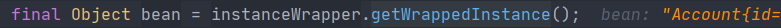
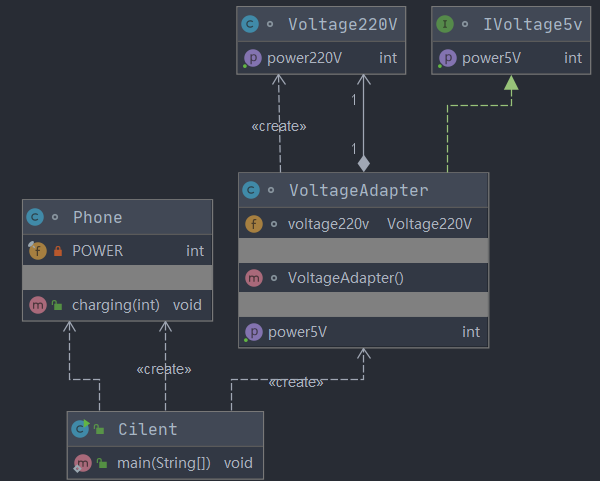

# Design pattern

## 一. 设计模式七大原则

### 1. 设计模式的目的

* 程序员面临来自耦合性，内聚性以及可维护性，可扩展性，重用性，灵活性

* 面向对象设计原则是用于评价一个设计模式的使用效果的重要指标之一
* 面向对象设计原则为支持可维护性复用而诞生指导性原则，非强制性原则

### 2. 常用的六大原则 Plus

| **设计原则名称**                                        | **设计原则简介**                                             |
| ------------------------------------------------------- | ------------------------------------------------------------ |
| **单一职责原则**(Single  Responsibility Principle, SRP) | 类的职责要单一，不能将太多的职责放在一个类中                 |
| 接口隔离原则(Interface  Segregation Principle, ISP)     | 使用多个专门的接口来取代一个统一的接口                       |
| **依赖倒转原则**(Dependency  Inversion Principle, DIP)  | 要针对抽象层编程，而不要针对具体类编程                       |
| **里氏代换原则** (Liskov  Substitution Principle, LSP)  | 在软件系统中，一个可以接受基类对象的地方必然可以接受一个子类对象 |
| **开闭原则**(Open-Closed  Principle, OCP)               | 软件实体对扩展是开放的，但对修改是关闭的，即在不修改一个软件实体的基础上去扩展其功能 |
| 迪米特法则(Law  of Demeter, LOD)                        | 一个软件实体对其他实体的引用越少越好，或者说如果两个类不必彼此直接通信，那么这两个类就不应当发生直接的相互作用，而是通过引入一个第三者发生间接交互 |
| **合成复用原则**(Composite  Reuse Principle, CRP)       | 在系统中应该尽量多使用组合和聚合关联关系，尽量少使用甚至不使用继承关系 |

### 3. 单一职责原则

1. **基本介绍** 

    一个对象应该只包含==**单一的职责**==，并且该职责被完整地封装在一个类中。

    如:类A负责两个不同职责：职责1，职责2。 当职责1需求变更而改变A时，可能造成职责2执行错误，所以需要将类A的粒度分解为 A1，A2

2. **单一职责原则注意事项和细节** 

    1.  降低类的复杂度，一个类只负责一项职责。
    2.  提高类的可读性，可维护性
    3. 降低变更引起的风险
    4. 通常情况下，我们应当遵守**单一职责原则**。只有逻辑足够简单，才可以在**代码级**违反单一职责原则；只有类中方法数量足够少，可以在**方法级**别保持单一职责原则

### 4. 接口隔离原则

1. **基本介绍**

    1. 客户端不应该依赖它不需要的接口，即**一个类对另一个类的依赖应该建立在最小的接口**上

    2. 类图：

    3. 类A通过接口Interface1依赖类B，类C通过 接口Interface1依赖类D，如果接口 Interface1对于类A和类C来说不是最小接口， 那么类B和类D必须去实现他们不需要的方 法。

    4.  按隔离原则应当这样处理： 

        **将接口Interface1拆分为独立的几个接口**， 类A和类C分别与他们需要的接口建立依赖 关系。也就是采用接口隔离原则

2. **接口隔离原则**

    应传统方法的问题和使用接口隔离原则改进

    1. 类A通过接口Interface1依赖类B，类C通过接口Interface1依赖类D，如果接口 Interface1对于类A和类C来说不是最小接口，那么类B和类D必须去实现他们不 需要的方法
    2. 将**接口Interface1拆分为独立的几个接口**，类A和类C分别与他们需要的接口建立 依赖关系。也就是采用接口隔离原则
    3. 接口Interface1中出现的方法，根据实际情况拆分为三个接口
    4. 代码实现

### 5. 依赖倒转(倒置)原则

1. 基本介绍

    1. 高层模块不应该依赖低层模块，二者都应该依赖其抽象

    2. **抽象不应该依赖细节，细节应该依赖抽象**

    3. 依赖倒转(倒置)的中心思想是**面向接口编程**

    4. 依赖倒转原则是基于这样的设计理念：

        相对于细节的多变性，抽象的东西要稳定的 多。以抽象为基础搭建的架构比以细节为基础的架构要稳定的多。在java中，抽象 指的是接口或抽象类，细节就是具体的实现类

    5. 使用**接口或抽象类**的目的是制定好**规范**，而不涉及任何具体的操作，把**展现细节的任务交给他们的实现类**去完成

2. 依赖关系传递的三种方式

    1. 接口传递				
    2. 构造方法 		   	
    3. setter方式传递      

3. 依赖倒转原则的注意事项和细节

    1. **低层模块尽量都要有抽象类或接口**，或者两者都有，程序稳定性更好。
    2. 变量的**声明类型尽量是抽象类或接口**, 这样我们的变量引用和实际对象间，就存在**一个缓冲层**，利于程序扩展和优化。
    3. 继承时遵循**里氏替换原则**

### 6. 里氏替换原则

1. **OO中的继承性说明**

    1. 继承包含这样一层含义：父类中凡是已经实现好的方法，实际上是在设定规范和契约，虽然它不强制要求所有的子类必须遵循这些契约，但是如果**子类对这些已经实现的方法任意修改**，就会**对整个继承体系造成破坏**。
    2. 继承在给程序设计带来便利的同时，也带来了弊端。比如使用继承会给程序带来**侵入性**，程序的**可移植性降低**，**增加对象间的耦合性**，如果一个类被其他的类所继承， 则当这个类需要修改时，必须考虑到所有的子类，并且父类修改后，所有涉及到子类的功能都有可能产生故障

2. 基本介绍

    1. 里氏替换原则(Liskov Substitution Principle)在1988年，由麻省理工学院的以为姓里的女士提出的。
    2. 如果对每个类型为T1的对象o1，都有类型为T2的对象o2，使得以T1定义的所有程序P在所有的对象o1都代换成o2时，程序P的行为没有发生变化，那么类型T2是类型T1 的子类型。换句话说，**所有引用基类的地方必须能透明地使用其子类的对象**。
    3. 在使用继承时，遵循里氏替换原则，在**子类中尽量不要重写父类的方法**
    4. 里氏替换原则告诉我们，继承实际上让两个类**耦合性增强**了，在适当的情况下，可以通过**聚合，组合，依赖**来解决问题。

3. 解决方法

    1. 我们发现原来运行正常的相减功能发生了错误。原因就是类B无意中重写了父类的方法，造成原有功能出现错误。在实际编程中，我们常常会通过重写父类的方法完 成新的功能，这样写起来虽然简单，但整个继承体系的复用性会比较差。特别是运行多态比较频繁的时候

    2. 通用的做法是：

        原来的父类和子类都**继承一个更通俗的基类**，原有的继承关系去掉， **采用依赖，聚合，组合**等关系代替。

### 7. 开闭原则

1. **基本介绍**

    1. 开闭原则（Open Closed Principle）是编程中**最基础、最重要的设计原则**

    2. 一个软件实体如类，模块和函数应该**对扩展开放(对提供方)**，**对修改关闭(对使用方)**。***用抽象构建框架，用实现扩展细节***。
    3. 当软件需要变化时，尽量通过扩展软件实体的行为来实现变化，而不是通过修改已有的代码来实现变化。
    4. 编程中遵循其它原则，以及使用**设计模式的目的就是遵循开闭原则**。

2. **解决方法**

    1. 利用继承抽象方法或者实现接口，实现多态。

### 8. 迪米特法则

1. **基本介绍**

    1. 一个对象应该对其他对象**保持最少的了解**

    2. 类与类关系越密切，耦合度越大

    3. 迪米特法则(Demeter Principle)又叫**最少知道原则**，即一个类对自己依赖的类知道的**越少越好**。也就是说，对于被依赖的类不管多么复杂，都尽量**将逻辑封装在类的内部**。对外除了提供的public 方法，不对外泄露任何信息

    4. 迪米特法则还有个更简单的定义：**只与直接的朋友通信**

    5. **直接的朋友**：

        每个对象都会与其他对象有耦合关系，只要两个对象之间有耦合关系， 我们就说这两个对象之间是朋友关系。耦合的方式很多，**依赖，关联，组合，聚合**等。其中，我们称出现成员变量，方法参数，方法返回值中的类为直接的朋友，而出现在局部变量中的类不是直接的朋友。也就是说，**陌生的类最好不要以局部变量的形式出现**在类的内部。

2. 迪米特法则注意事项和细节

    1. 迪米特法则的核心是***降低类* 之间的耦合**
    2. 但是注意，由于每个类都减少了不必要的依赖，因此迪米特法则只是要求**降低**类间(对象间)耦合关系，并不是要求完全没有依赖关系

### 9. 合成复用原则 +

1. **基本介绍** 

    原则是尽量使用**合成/聚合**的方式，而不是使用继承

2. **设计原则核心思想** 

    1. 找出应用中可能需要变化之处，把它们独立出来，不要和那些不需要变化的代码混在一起。
    2. 针对接口编程，而不是针对实现编程。
    3. 为了交互对象之间的**松耦合**设计而努力
    
3. 复用分类

    1. 继承复用：实现**简单**，**易于扩展**。

        * **破坏系统的封装性；**

        * 从基类继承而来的实现是静态的，不可能在运行时发生改变，没有足够的灵活性；

        * **只能在有限的环境中使用。（==白箱==复用 ）**

    2. 组合/聚合复用：**耦合度相对较低**，

        * **选择性地调用成员对象的操作，比较灵活；**
        * **可以在运行时动态进行。（==黑箱==复用 ）**


---

## 二. UML类图

### 1. UML基本介绍

1. UML——Unified modeling language UML (统一建模语言)，是一种用于软件系统分析和设计的语言工具，它用 于帮助软件开发人员进行思考和记录思路的结果
2. UML 本身是一套符号的规定，就像数学符号和化学符号一样，这些符号用于描述软件模型中的各个元素和他 们之间的关系，比如类、接口、实现、泛化、依赖、组合、聚合等，如右图

### 2. UML图

1. 用例图(use case)
2. 静态结构图：类图、对象图、包图、组件图、部署图
3. 动态行为图：交互图（时序图与协作图）、状态图、活动图
4. UML 类图
    1. 用于描述系统中的**类(对象)本身的组成和类(对象)之间的各种静态关系**。
    2. ***类之间的六大关系***：**依赖、泛化（继承）、实现 | 关联、聚合与组合**。

### 3. 依赖关系（Dependence）

1. 只要是在**类中用到了对方，那么他们之间就存在依赖关系**。如果没有对方，编绎都通过不了。
2. 总结
    * 类中用到了对方
    * 如果是类的成员属性
    * 如果是方法的返回类型
    * 是方法接收的参数类型
    * 方法中使用到

### 4. 泛化关系 (Generalization）

1. 泛化关系实际上就是**继承关系**，他是**依赖关系**的特例

2. 总结
    * 泛化关系实际上就是**继承关系**
    * 如果 A 类继承了 B 类，我们就说 A 和 B 存在泛化关系
    * **相互联系最强**

### 5. 实现关系（Implementation）

1. 实现关系实际上就是 **A 类实现 B 接口**，他是**依赖关系**的特例

### 6. 关联关系（Association）

1. 关联关系实际上就是**类与类之间的联系，他是依赖关系的特例**

2. 关联具有导航性：即双向关系或单向关系 

    关系具有多重性：如“1”（表示有且仅有一个），“0...”（表示0个或者多个）， “0，1”（表示0个或者一个），“n...m”(表示n到 m个都可以),“m...*”（表示至少m 个）。

3. 单向一对一关系

    ```java
    public class Person {
    	private IDCard card;
    }
    public class IDCard{}
    ```

    

4. 双向一对一关系

    ```java
    public class Person{ 
        private IDCard card; 
    }
    public class IDCard{
        private Person person 
    }
    ```

    

### 7. 聚合关系（Aggregation）

1. 聚合关系（Aggregation）表示的是**整体和部分**的关系，整体与部分**可以分开**。**聚合关系是关联关系的特例**，所以他具有关联的**导航性**与**多重性**。 

    如：一台电脑由键盘(keyboard)、显示器(monitor)，鼠标等组成；组成电脑的各个 配件是可以从电脑上分离出来的，使用带空心菱形的实线来表示：


### 8. 组合关系（Composition）

1. **组合关系**：也是整体与部分的关系，但是**整体与部分不可以分开**。 同生共死。

    


## 三. 设计模式

### 设计模式概述

1. 掌握设计模式的五层
    * 第 1 层：刚开始学编程不久，听说过什么是设计模式
    * 第 2 层：有很长时间的编程经验，自己写了很多代码，其中用到了设计模式，但是自己却不知道
    * 第 3 层：学习过了设计模式，发现自己已经在使用了，并且发现了一些新的模式挺好用的
    * 第 4 层：阅读了很多别人写的源码和框架，在其中看到别人设计模式，并且能够领会设计模式的精妙和带来的 好处。
    * 第 5 层：代码写着写着，自己都没有意识到使用了设计模式，并且熟练的写了出来。

2.  设计模式介绍

    1. 模式是**在特定环境下**人们解决某类重复出现**问题**的一套成功或有效的**解决方案**。
2. 设计模式是程序员在面对同类软件工程设计问题所总结出来的有用的经验，模式不是代码，而是某类问题的通 用解决方案，设计模式（Design pattern）代表了**最佳的实践**。这些解决方案是众多软件开发人员经过相当长的 一段时间的试验和错误总结出来的。
   
    3. 设计模式的本质提高软件的维护性，通用性和扩展性，并降低软件的复杂度。
4. **`设计模式`** ，作者是 Erich Gamma、Richard Helm、Ralph Johnson 和 John Vlissides Design（俗称 “四人组 GOF”）
   
5. 设计模式并不局限于某种语言，java，php，c++ 都有设计模式。
   
3. 关键要素

    1. **模式名称** **(Pattern Name)** 

        一个模式的名称高度概括该模式的本质，有利于该行业统一术语、便于交流使用。

    2. **问题** **(Problem)** 

        描述应该在何时使用模式，解释设计问题和问题存在的前因后果，描述在怎样的环境下使用该模式。

    3. **解决方案** **(Solution)** 

        描述设计的组成部分，它们之间的相互关系及各自的职责和协作方式。

    4. **效果(Consequences)** 

        描述模式的应用效果及使用模式应当权衡的问题。主要效果包括使用模式对系统的灵活性、扩充性和复用性的影响。

6. 设计模式类型 

    1. 创建型(Creational)模式
        * 涉及对象的实例化
        * 这类模式的特点是，不让用户代码依赖于对象的创建或排列方式
        * 避免用户直接使用new运算符创建对象。

    2. 结构型(Structural)模式
        * 涉及如何组合类和对象以形成更大的结构
        * 和类有关的结构型模式涉及如何合理地使用继承机制
        * 和对象有关的结构型模式涉及如何合理地使用对象组合机制

    3. 行为型(Behavioral)模式
        * 涉及怎样合理地设计对象之间的交互通信
        * 以及怎样合理为对象分配职责
        * 让设计富有弹性,易维护,易复用。

    4. 设计模式分为三种类型，共 23 种
        1. **创建型模式**：**单例模式**、**抽象工厂模式**、**原型模式**、**建造者模式**、**工厂模式**。
        2. **结构型模式**：**适配器模式**、**桥接模式**、**装饰者模式**、**组合模式**、**外观模式**、**享元模式**、**代理模式**。
        3. **行为型模式**：模版方法模式、**命令模式**、访问者模式、**迭代器模式**、**观察者模式**、中介者模式、备忘录模式、 解释器模式（Interpreter 模式）、状态模式、策略模式、职责链模式(责任链模式)。


---

### 创建型模式

| 模式名称                                 | 定义                                                         |
| ---------------------------------------- | ------------------------------------------------------------ |
| 简单工厂模式  (Simple Factory Pattern)   | 定义一个工厂类，它可以根据参数的不同返回不同类的实例，被创建的实例通常都具有共同的父类。 |
| 工厂方法模式  (Factory Method Pattern)   | 定义一个用于创建对象的接口，但是让子类决定将哪一个类实例化。工厂方法模式让一个类的实例化延迟到其子类。 |
| 抽象工厂模式  (Abstract Factory Pattern) | 提供一个创建一系列相关或相互依赖对象的接口，而无须指定它们具体的类。 |
| 建造者模式  (Builder Pattern)            | 将一个复杂对象的构建与它的表示分离，使得同样的构建过程可以创建不同的表示。 |
| 原型模式  (Prototype Pattern)            | 使用原型实例指定待创建对象的类型，并且通过复制这个原型来创建新的对象。 |
| 单例模式  (Singleton Pattern)            | 确保一个类只有一个实例，并提供一个全局访问点来访问这个唯一实例。 |

#### 1. 单例设计模式

> 单例设计模式介绍 

所谓类的单例设计模式，就是采取一定的方法保证在整个的软件系统中，对某个类只能存在一个对象实例， 并且该类只提供一个取得其对象实例的方法(静态方法)。 比如 Hibernate 的 SessionFactory，它充当数据存储源的代理，并负责创建 Session 对象。SessionFactory 并不是轻量级的，一般情况下，一个项目通常只需要一个 SessionFactory 就够，这是就会使用到单例模式。

> 单例设计模式八种方式

* 饿汉式(静态常量) 
* 饿汉式（静态代码块）
* 懒汉式(线程不安全)
* 懒汉式(线程安全，同步方法)
* 懒汉式(线程安全，同步代码块)
* 双重检查
* 静态内部类
* 枚举

> 饿汉式

  

* 类图    

* **静态常量**    

    应用实例 步骤如下：

    * 构造器私有化 (防止直接新建实例对象) 
    * 类的内部创建对象
    * 向外暴露一个静态的公共方法。getInstance
    * 代码示例

    ```java
    class Singleton{
        private final static Singleton SINGLETON = new Singleton();
        private Singleton(){}
        public static Singleton getInstance(){
            return SINGLETON;
        }
    }
    ```

    * **优点**：这种写法比较简单，就是在类装载的时候就完成实例化。**避免了线程同步问题**。
    * **缺点**：在类装载的时候就完成实例化，没有达到 Lazy Loading 的效果。如果从始至终从未使用过这个实例，则会造成**内存的浪费**
    * 这种方式**基于 classloder 机制**避免了多线程的同步问题，不过，instance 在类装载时就实例化，在单例模式中大多数都是调用 getInstance 方法，但是导致类装载的原因有很多种，因此不能确定有其他的方式（或者其他的静 态方法）导致类装载，这时候初始化 instance 就**没有达到 lazy loading 的效果** 。

* **静态代码块**

    * 代码示例

        ```java
        class Singleton{
            private static Singleton singleton;
            static {
                singleton = new Singleton();
            }
            private Singleton(){}
            public static Singleton getInstance(){
                return singleton;
            }
        }
        ```

    * **分析**：这种方式和上面的方式其实类似，只不过将类实例化的过程放在了静态代码块中，也是在类装载的时候，就执行静态代码块中的代码，初始化类的实例。**优缺点和前一种相同**。

> 懒汉式

* **线程不安全**

    ```java
    class Singleton{
        private static Singleton singleton;
        private Singleton(){}
        public static Singleton getInstance(){
            if(singleton == null) {
                singleton = new Singleton();
            }
            return singleton;
        }
    }
    ```

    * 优点：起到了 Lazy Loading 的效果，但是只能在单线程下使用。
    * 缺点：如果在多线程下，一个线程进入了 if (singleton == null)判断语句块，还未来得及往下执行，另一个线程也通过 了这个判断语句，这时便会产生多个实例。所以在**多线程环境下不可使用这种方式**。
    * **结论**：在实际开发中，**不要使用这种方式**.

* **线程安全**，同步方法/同步代码块    `synchronized`

    ```java
    class Singleton{
        private static Singleton singleton;
        private Singleton(){}
        //同步方法
        public static synchronized Singleton getInstance(){
            if(singleton == null) {
                singleton = new Singleton();
            }
            return singleton;
        }
        /**
        同步代码块,错误！！！！
            if(singleton == null) {
                synchronized (Singleton.class){
                    singleton = new Singleton();
                }
            }
        **/
    }
    ```

    * 优点：**解决了线程安全问题**
    * 缺点：**效率太低**了，每个线程在想获得类的实例时候，执行 getInstance()方法都要进行同步。方法进行**同步效率太低。**
    *  结论：在实际开发中，**不推荐**使用这种方式

> 线程安全，高效率

* **双重检查**

    ```java
    class Singleton{
        private static volatile Singleton singleton;
        private Singleton(){}
        public static synchronized Singleton getInstance(){
            if(singleton == null) {
                synchronized (Singleton.class){
                    if(singleton == null) {
                        singleton = new Singleton();
                    }
                }
            }
            return singleton;
        }
    }
    ```

    * **Double-Check** 概念是多线程开发中常使用到的，如代码中所示，我们进行了两次 if (singleton == null)检查，这样就可以保证线程安全了。
    * 这样，实例化代码只用执行一次，后面再次访问时，判断 if (singleton == null)，直接 return 实例化对象，也避 免的反复进行方法同步。
    * **优点**：线程安全；**延迟加载**；**效率较高**    **推荐使用**这种单例设计模式

* **静态内部类**

    ```java
    
    ```

    * 这种方式采用了类装载的机制来保证初始化实例时只有一个线程。
    * 静态内部类方式在Singleton类被装载时并不会立即实例化，而是在需要实例化 时，调用getInstance方法，才会装载**SingletonInstance类**，从而完成Singleton的实例化。
    * 类的静态属性只会在第一次加载类的时候初始化，所以在这里，**JVM帮助**我们保证了线程的安全性，在类进行**初始化时，别的线程是无法进入**的。
    * 优点：避免了线程不安全，利用静态内部类特点实现**延迟加载**，**效率高**    **推荐使用**

* **枚举**

    ```java
    enum Singleton {
        INSTANCE;
        public void sayOK() {
            System.out.println("ok~");
        }
    }
    ```

    * 这借助JDK1.5中添加的枚举来实现单例模式。不仅能**避免多线程同步**问题，而且还能**防止反序列化**重新创建新的对象。
    * 这种方式是Effective Java**作者**Josh Bloch **提倡**的方式，**推荐使用**

> 实际场景分析

* java.lang.Runtime

    

> 单例模式注意事项和细节说明 

1. 单例模式保证了 系统内存中该类只存在一个对象，**节省了系统资源**，对于一些需要**频繁创建销毁的对象**，使 用单例模式可以提高系统性能
2. 当想实例化一个单例类的时候，必须要记住使用相应的获取对象的方法，而不是使用 new
3. 单例模式**使用的场景**：**需要频繁的进行创建和销毁的对象**、**创建对象时耗时过多或耗费资源过多**(即：重量级 对象)，但又经常用到的对象、**工具类**对象、**频繁访问**数据库或文件的对象(比如**数据源、session 工厂**等)


#### 2. 工厂模式

> 简单工厂模式

* 基本介绍

    * 简单工厂模式是属于**创建型模式**，是工厂模式的一种。简单工厂模式是由一 个工厂对象决定创建出哪一种产品类的实例。简单工厂模式是工厂模式家族 中最简单实用的模式。
    *  简单工厂模式：定义了一个创建对象的类，由这个类来封装实例化对象的行为(代码)。
    * 在软件开发中，当我们会用到大量的创建某种、某类或者某批对象时，就会使用到工厂模式.

* 实例类图

    

* 实例关键代码

    ```java
    if (orderType.equals("greek")) {
    	pizza = new GreekPizza();
    	pizza.setName(" 希腊披萨 ");
    } else if (orderType.equals("cheese")) {
    	pizza = new CheesePizza();
    	pizza.setName(" 奶酪披萨 ");
    } else if (orderType.equals("pepper")) {
    	pizza = new PepperPizza();
    	pizza.setName("胡椒披萨");
    }
    ```

    也可使用反射实现

> 工厂方法模式

* **工厂方法模式介绍** 

    * 工厂方法模式设计方案：将披萨项目的实例化功能抽象成抽象方法，在不同的口味点餐子类中具体实现。 
    * 工厂方法模式：**定义了一个创建对象的抽象方法**，由**子类决定要实例化的类**。工厂方 法模式将对象的**实例化推迟到子类**。

* 实例类图

    

* 实例关键代码

    ```java
    public class BJOrderPizza extends OrderPizza {
        @Override
    	Pizza createPizza(String orderType) {
    		Pizza pizza = null;
    		if(orderType.equals("cheese")) {
    			pizza = new BJCheesePizza();
    		} else if (orderType.equals("pepper")) {
    			pizza = new BJPepperPizza();
    		}
    		return pizza;
    	}
    }
    ```

    

> 抽象工厂模式

* 基本介绍

    * 抽象工厂模式：定义了一个 **interface 用于创建相关或有依赖关系的对象簇**，而无需指明具体的类。
    * 抽象工厂模式可以将简单工厂模式和工厂方法模式进行整合。
    * 从设计层面看，抽象工厂模式就是对简单工厂模式的改进(或者称为进一步的抽象)。
    * 将工厂抽象成**两层**，**AbsFactory(抽象工厂)** 和 **具体实现的工厂子类**。程序员可以根据创建对象类型使用对应 的工厂子类。这样将单个的简单工厂类变成了**工厂簇**，更**利于代码的维护和扩展**。

* 实例类图

    

* 实例代码

    ```java
    public class BJFactory implements AbsFactory {
    	@Override
    	public Pizza createPizza(String orderType) {
    		System.out.println("~使用的是抽象工厂模式~");
    		Pizza pizza = null;
    		if(orderType.equals("cheese")) {
    			pizza = new BJCheesePizza();
    		} else if (orderType.equals("pepper")){
    		pizza = new BJPepperPizza();
    		}
    		return pizza;
    	}
    }
    ```
    
* 优点

    * 抽象工厂模式**隔离了具体类的生成**，使得客户并不需要知道什么产品被创建
    * 由于这种隔离，更换一个具体工厂就变得相对容易。所有的具体工厂都实现了抽象工厂中定义的那些公共接口，因此只**需改变具体工厂的实例，就可以在某种程度上改变整个软件系统的行为**
    * 应用抽象工厂模式可以实现**高内聚低耦合的设计目的**
    * 当一个产品族中的多个对象被设计成一起工作时，**它能够保证客户端始终只使用同一个产品族中的对象**。
    * 增加新的具体工厂和产品族很方便，无须修改已有系统，符合“**开闭原则**”。

> 实际场景分析

* Calendar

    * JDK 中的 Calendar 类中，就使用了简单工厂模式

        

> 工厂方法小结

* 不同工厂模式对比
  
    | 模式 | 抽象产品类 | 具体产品类 | 抽象工厂类 | 具体工厂类 | 一个具体工厂创建具体产品类实例 |
| -------- | -------------- | -------------- | -------------- | -------------- | ---------------------------------- |
    | 简单工厂 | 一个           | 多个           | 无             | 一个  静态     | 多个                               |
    | 工厂方法 | 一个           | 多个           | 一个           | 多个           | 一个                               |
    | 抽象工厂 | 多个           | 多个           | 一个           | 多个           | 一个产品族                         |
    
* 工厂模式的意义 
  
    * 将实例化对象的代码提取出来，放到一个类中统一管理和维护，达到和主项目的依赖关系的解耦。从而提高项 目的扩展和维护性。
* 三种工厂模式 (简单工厂模式、工厂方法模式、抽象工厂模式) 
  
* 工厂模式的注意事项
    * 设计模式的依赖抽象原则
    * 创建对象实例时，不要直接 new 类, 而是把这个 new 类的动作放在一个工厂的方法中，并返回。有的书上说， 变量不要直接持有具体类的引用。
    * 不要让类继承具体类，而是继承抽象类或者是实现 interface(接口)。
    * 不要覆盖基类中已经实现的方法。

#### 3.  原型模式

> 原型模式介绍

* 原型模式(Prototype 模式)是指：用**原型实例指定创建对象的种类**，**并且通过拷贝这些原型**，**创建新的对象**。
* 原型模式是一种创建型设计模式，允许一个对象再创建另外一个可定制的对象，无需知道如何创建的细节。
* 工作原理是:通过将一个原型对象传给那个要发动创建的对象，这个要发动创建的对象通过请求原型对象拷贝它 们自己来实施创建，即**对象.clone()**。

> 原型模式 UML图

* uml图

    重写clon方法

* 原理结构图说明
    * Prototype : 原型类，声明一个克隆自己的接口
    * ConcretePrototype: 具体的原型类, 实现一个克隆自己的操作
    * Client: 让一个原型对象克隆自己，从而创建一个新的对象(属性一样）

> 浅克隆与深克隆

* 浅克隆介绍

    * 对于数据类型是基本数据类型的成员变量，浅拷贝会直接进行值传递，也就是将该属性值复制一份给新的对象。
    * 对于数据类型是引用数据类型的成员变量，比如说成员变量是某个数组、某个类的对象等，那么浅拷贝会进行 引用传递，也就是只是将该成员变量的引用值（内存地址）复制一份给新的对象。因为实际上两个对象的该成 员变量都指向同一个实例。在这种情况下，在一个对象中修改该成员变量会影响到另一个对象的该成员变量值。
    * 浅拷贝是使用默认的 clone()方法来实现。

* 深克隆介绍

    * 复制对象的所有基本数据类型的成员变量值。
    * 为所有引用数据类型的成员变量申请存储空间，并复制每个引用数据类型成员变量所引用的对象，直到该对象 可达的所有对象。也就是说，对**象进行深拷贝要对整个对象(包括对象的引用类型)进行拷贝**。
    * 深拷贝实现方式 1：**重写 clone 方法**来实现深拷贝。
    * 深拷贝实现方式 2：通过**对象序列化**实现深拷贝(推荐)

* 浅克隆代码

    ```java
    @Override
    protected Object clone() {
    	Sheep sheep = null;
    	try {
    		sheep = (Sheep)super.clone();
    	} catch (Exception e) {
    		System.out.println(e.getMessage());
    	}
    }
    ```

* 深克隆代码

    * **重写 clone 方法**

        ```java
        //深拷贝 - 方式 1 使用 clone 方法
        @Override
        protected Object clone() throws CloneNotSupportedException {
        	Object deep = null;
        	//这里完成对基本数据类型(属性)和 String 的克隆
        	deep = super.clone();
        	//对引用类型的属性，进行单独处理
        	DeepProtoType deepProtoType = (DeepProtoType)deep;
        	deepProtoType.deepCloneableTarget = 
                (DeepCloneableTarget)deepCloneableTarget.clone();
        	return deepProtoType;
        }
        ```

    * **对象序列化**

        ```java
        //深拷贝 - 方式 2 通过对象的序列化实现 (推荐)
        public Object deepClone() {
        	//创建流对象
        	ByteArrayOutputStream bos = null;
        	ObjectOutputStream oos = null;
        	ByteArrayInputStream bis = null;
        	ObjectInputStream ois = null;
        	try {
        		//序列化
        		bos = new ByteArrayOutputStream();
        		oos = new ObjectOutputStream(bos);
        		oos.writeObject(this); //当前这个对象以对象流的方式输出
        		//反序列化
        		bis = new ByteArrayInputStream(bos.toByteArray());
        		ois = new ObjectInputStream(bis);
        		DeepProtoType copyObj = (DeepProtoType)ois.readObject();
        		return copyObj;
        	} catch (Exception e) {
        		e.printStackTrace();
        		return null;
        	} finally {
        		//关闭流
        		try {
        		bos.close();
        		oos.close();
        		bis.close();
        		ois.close();
        	} catch (Exception e2) {
        		System.out.println(e2.getMessage());
        	}
        }
        ```

> 实际场景分析

* Spring Bean property 
    * 类似重写clone的方法
    
        
    * 完成对基本属性的克隆
    * 注入值

> 原型模式的注意事项和细节

* 创建新的对象比较复杂时，可以利用原型模式简化**对象的创建过程**，**同时也能够提高效率**。
* 不用重新初始化对象，而是**动态地获得对象运行时**的状态。
* 如果原始对象发生变化(增加或者减少属性)，其它克隆对象的也会发生相应的变化，无需修改代码。
* 在实现深克隆的时候可能需要比较复杂的代码。
* **缺点**：需要为**每一个类配备一个克隆方法**，这对全新的类来说不是很难，但对已有的类进行改造时，需要修改 其源代码，**违背了 ocp 原则**


#### 4.  建造者模式

> 建造者模式基本介绍

*  建造者模式（Builder Pattern） 又叫生成器模式，是一种对象构建模式。它可以将**复杂对象的建造过程抽象化**（抽象类别），使这个抽象过程的不同实现方法可以构造出不同表现（属性）的对象。
* 建造者模式是一步一步创建一个复杂的对象，它允许用户**只通过指定复杂对象的类型和内容**就可以构建它们， 用户**不需要知道内部的具体构建细节**。

> 建造者模式的四个角色

* Product（产品角色）： 一个具体的产品对象。
* Builder（抽象建造者）： 创建一个 Product 对象的各个部件指定的 接口/抽象类。
* ConcreteBuilder（具体建造者）： 实现接口，构建和装配各个部件。
* Director（指挥者）： 构建一个使用 Builder 接口的对象。它主要是用于创建一个复杂的对象。它主要有两个作用:
    * **隔离了客户与对象的生产过程**。
    * 负责**控制**产品对象的**生产过程**。

> 实例类图


> 实例关键代码

```java
//指挥者    Director
class HouseDirector {
    HouseBuilder houseBuilder = null;
    //构造器传入 houseBuilder
    public HouseDirector(HouseBuilder houseBuilder) {
        this.houseBuilder = houseBuilder;
    }
    //通过 setter 传入 houseBuilder
    public void setHouseBuilder(HouseBuilder houseBuilder) {
        this.houseBuilder = houseBuilder;
    }
    //如何处理建造房子的流程，交给指挥者
    public House constructHouse() {
        houseBuilder.buildBasic();
        houseBuilder.buildWalls();
        houseBuilder.roofed();
        return houseBuilder.buildHouse();
    }
}

//抽象建造者    Builder
abstract class HouseBuilder {
    protected House house = new House();
    //将建造的流程写好, 抽象的方法
    public abstract void buildBasic();
    public abstract void buildWalls();
    public abstract void roofed();
    //建造房子好， 将产品(房子) 返回
    public House buildHouse() {
        return house;
    }
}

//具体建造者    ConcreteBuilder
class HighBuilding extends HouseBuilder {
    public void buildBasic() {
        System.out.println(" 高楼的打地基 100 米 ");
    }
    public void buildWalls() {
        System.out.println(" 高楼的砌墙 20cm ");
    }
    public void roofed() {
        System.out.println(" 高楼的透明屋顶 ");
    }
}

public class Client {
    public static void main(String[] args) {
        //盖普通房子
        CommonHouse commonHouse = new CommonHouse();
        //准备创建房子的指挥者
        HouseDirector houseDirector = new HouseDirector(commonHouse);
        //完成盖房子，返回产品(普通房子)
        House house = houseDirector.constructHouse();
        //盖高楼
        HighBuilding highBuilding = new HighBuilding();
        //重置建造者
        houseDirector.setHouseBuilder(highBuilding);
        //完成盖房子，返回产品(高楼)
        houseDirector.constructHouse();
    }
}
```


> 实际场景分析

* StringBuilder

    * Appendable接口定义了多个 append 方法(抽象方法), 即 **Appendable 为抽象建造者**, 定义了抽象方法

    *  AbstractStringBuilder 实现了 Appendable 接口方法，这里的 **AbstractStringBuilder 已经是建造者**，只是不能实例化

    *  **StringBuilder 即充当了指挥者角色**，同时充当了具体的建造者，建造方法的实现是由 AbstractStringBuilder 完 成, 而 StringBuilder 继承了 AbstractStringBuilder

        


> 建造者模式的注意事项和细节

* 客户端(使用程序)**不必知道产品内部组成的细节，将产品本身与产品的创建过程解耦，使得相同的创建过程可 以创建不同的产品对象。**

* 每一个具体建造者都相对独立，而与其他的具体建造者无关，因此可以很方便地替换具体建造者或增加新的具 体建造者， **用户使用不同的具体建造者即可得到不同的产品对象**。

* **可以更加精细地控制产品的创建过程** 。将复杂产品的创建步骤分解在不同的方法中，使得创建过程更加清晰， 也更方便使用程序来控制创建过程。

* **增加新的具体建造者无须修改原有类库的代码**，指挥者类针对抽象建造者类编程，系统扩展方便，**符合“开闭原则”**。

*  建造者模式所创建的**产品一般具有较多的共同点**，其组成部分相似，如果产品之间的**差异性很大，则不适合使用建造者模式**，因此其使用范围受到一定的限制。

* 如果产品的内部变化复杂，可能会导致需要定义很多具体建造者类来实现这种变化，导致系统变得很庞大，因 此在这种情况下，要考虑是否选择建造者模式。

* **抽象工厂模式** VS **建造者模式** 

    抽象工厂模式实现对**产品家族的创建**，一个产品家族是这样的一系列产品：具有不同分类维度的产品组合，采 用抽象工厂模式**不需要关心构建过程**，**只关心什么产品由什么工厂生产**即可。

    建造者模式则是要求**按照指定的蓝图建造产**品，它的主要目的是通过组装零配件而产生一个新产品。

> 建造者模式适用环境

* **需要生成的产品对象有复杂的内部结构**，这些产品对象通常包含多个成员属性。
* **需要生成的产品对象的属性相互依赖**，需要指定其生成顺序。
* **对象的创建过程独立于创建该对象的类**。在建造者模式中引入了指挥者类，将创建过程封装在指挥者类中，而不在建造者类中
* **隔离复杂对象的创建和使用，并使得相同的创建过程可以创建不同的产品。**

---

### 结构型模式

| 模式名称                                    | 定 义                                                |
| ----------------------------------------------- | ------------------------------------------------------------ |
| 适配器模式(Adapter Pattern)             | 将一个类的接口转换成客户希望的另一个接口。适配器模式让那些接口不兼容的类可以一起工作。 |
| 桥接模式(Bridge Pattern)                | 将抽象部分与它的实现部分解耦，使得两者都能够独立变化。   |
| 装饰模式(Decorator Pattern)     | 动态地给一个对象增加一些额外的职责。就扩展功能而言，装饰模式提供了一种比使用子类更加灵活的替代方案。 |
| 组合模式(Composite Pattern)         | 组合多个对象形成树形结构，以表示具有部分-整体关系的层次结构。组合模式让客户端可以统一对待单个对象和组合对象。 |
| 外观模式(Facade Pattern)        | 为子系统中的一组接口提供一个统一的入口。外观模式定义了一个高层接口，这个接口使得这一子系统更加容易使用。 |
| 享元模式(Flyweight Pattern) | 运用共享技术有效地支持大量细粒度对象的复用。             |
| 代理模式  (Proxy Pattern)               | 给某一个对象提供一个代理或占位符，并由代理对象来控制对原对象的访问。 |

#### 1. 适配器模式

> 适配器模式基本介绍

* 适配器模式(Adapter Pattern)将某个类的接口转换成客户端期望的另一个接口表示，主的目的是**兼容性**，让原本因接口不匹配不能一起工作的两个类可以协同工作。其别名为包装器(Wrapper)
* 适配器模式属于结构型模式
* 主要分为三类：**类适配器模式**、**对象适配器模式**、**接口适配器模式**

> 基本原理

* 适配器模式：将一个类的接口转换成另一种接口
* 让原本接口不兼容的类可以兼容
* 从用户的角度看不到被适配者，是**解耦**的
* 用户调用适配器转化出来的目标接口方法，适配器再调用被适配者的相关接口方法

> 类适配器模式

* 实例类图

    

* 类适配器模式注意事项和细节

    * Java 是单继承机制，所以类适配器需要继承 src 类这一点算是一个缺点, 因为这要求 **dst 必须是接口**，**有一定局限性**。
    * src 类的方法在 **Adapter 中都会暴露出来**，也**增加了使用的成本**。
    * 由于其继承了 src 类，所以它**可以根据需求重写 src 类的方法**，使得 Adapter 的**灵活性增强**了。

> 对象适配器模式

* 介绍

    * 基本思路和类的适配器模式相同，只是将 Adapter 类作修改，不是继承 src 类，而是持有 src 类的实例，以解决 兼容性的问题。 即：持有 src 类，实现 dst 类接口，完成 src->dst 的适配 。
    * 根据“**合成复用原则**”，在系统中尽量**使用关联关系（聚合）来替代继承关系**。
    * 对象适配器模式是**适配器模式常用的一种**。

* 实例类图

    

* 对象适配器模式注意事项和细节

    * 对象适配器和类适配器其实算是同一种思想，只不过实现方式不同。 根据**合成复用原则**，使用组合替代继承， 所以它解决了类适配器必须继承 src 的局限性问题，也不再要求 dst 必须是接口。
    *  使用**成本更低，更灵活**。

> 接口适配器模式

* 介绍
    * 适配器模式(Default Adapter Pattern)或缺省适配器模式。
    * 核心思路：当不需要全部实现接口提供的方法时，可先设计一个抽象类实现接口，并为该接口中每个方法提供 一个默认实现（空方法），那么该抽象类的子类可有选择地覆盖父类的某些方法来实现需求
    * 适用于一个接口不想使用其所有的方法的情况。
    
* 实例类图

    

> 实际场景分析

* SpringMvc 中的 HandlerAdapter
    * 
    * 

> 适配器模式的注意事项和细节 

* 三种命名方式，是根据 src 是以怎样的形式给到 Adapter（在 Adapter 里的形式）来命名的。
    *  类适配器：以类给到，在 Adapter 里，就是将 src 当做类**继承**。
    *  对象适配器：以对象给到，在 Adapter 里，将 src 作为一个对象**持有** 。
    * 接口适配器：以接口给到，在 Adapter 里，将 src 作为一个接口**实现** 。
* Adapter 模式最大的作用还是将原本不兼容的接口融合在一起工作。
*  实际开发中，实现起来不拘泥于我们讲解的三种经典形式

#### 2. 桥接模式

> 桥接模式(Bridge)-基本介绍

* 桥接模式(Bridge 模式)是指：将实现与抽象放在两个不同的类层次中，使两个层次可以独立改变。可以**解决类爆炸**

* 一种结构型设计模式 
* Bridge 模式基于类的**最小设计原则**，通过使用封装、聚合及继承等行为让不同的类承担不同的职责。它的主要 特点是把**抽象(Abstraction)与行为实现(Implementation)分离**开来，从而可以保持各部分的独立性以及应对他们的功能扩展

> 实例类图


> 实际场景分析

* Jdbc 的 Driver 接口

    * 如果从桥接模式来看，Driver 就是一个接口，下面可以有 MySQL 的 Driver，Oracle 的 Driver，这些就可以当做实现接口类

        

> 桥接模式的注意事项和细节

* 实现了抽象和实现部分的分离，从而极大的提供了系统的灵活性，让抽象部分和实现部分独立开来，这有助于 系统进行分层设计，从而产生更好的结构化系统。
* 对于系统的高层部分，只需要知道抽象部分和实现部分的接口就可以了，其它的部分由具体业务来完成。
* **桥接模式替代多层继承方案**，可以减少**子类的个数**，降低系统的管理和维护成本。
* 桥接模式的引入增加了系统的理解和设计难度，由于聚合关联关系建立在抽象层，要求开发者针对抽象进行设 计和编程。
* 桥接模式要求正确识别出**系统中两个独立变化的维度(抽象、和实现)**，因此其使用范围有一定的局限性，即需 要有这样的应用场景。
* 对于那些**不希望使用继承或因为多层次继承**导致系统类的个数急剧增加的系统，桥接模式尤为适用.

> 常见的应用场景

* JDBC 驱动程序
* 银行转账系统 转账分类: 网上转账，柜台转账，AMT 转账 转账用户类型：普通用户，银卡用户，金卡用户.. 
* 消息管理 消息类型：即时消息，延时消息 消息分类：手机短信，邮件消息，QQ 消息...

#### 3. 装饰者模式

> 装饰者模式定义

* 装饰者模式：**动态的将新功能**附加到对象上。在对象功能扩展方面，它比继承更有弹性，装饰者模式也体现了**开闭原则**

> 装饰者模式原理

*  Component 主体
*  ConcreteComponent：具体的主体
*  Decorator: 装饰者

> 实例类图


> 实际场景分析


*  InputStream 是抽象类, 类似我们前面讲的 Drink
*  FileInputStream 是 InputStream 子类，类似我们前面的 DeCaf, LongBlack
*  FilterInputStream 、ByteArrayInputStream是 InputStream 子类：类似我们前面 的 **Decorator 修饰者**
*  DataInputStream 是 FilterInputStream 子类，**具体的修饰者**，类似前面的 Milk, Soy 等 
*  FilterInputStream 类 有 protected volatile InputStream in; 即含**被装饰者** 
* 分析得出在 jdk 的 io 体系中，就是使用装饰者模式

#### 4. 组合模式

> 组合模式介绍

* 组合模式（Composite Pattern），又叫部分整体模式，它创建了对象组的**树形结构**，将对象组合成树状结构以 表示**“整体-部分”的层次关系**。
* 组合模式依据树形结构来组合对象，用来表示部分以及整体层次。
* 这种类型的设计模式属于**结构型模式**。
* 组合模式使得用户对单个对象和组合对象的访问具有**一致性**，即：组合能让客户以一致的方式处理个别对象以及组合对象

> 实例类图


* Component :这是组合中对象声明接口，在适当情况下，实现所有类共有的接口默认行为,用于**访问和管理Component 子部件**, Component 可以是**抽象类或者接口**
* Composite :**非叶子节点，用于储存子部件**，在Component的接口中实现对于子部件的操作。
* Leaf : 在组合中表示**叶子节点**，叶子节点没有子节点

> 实际场景分析

* java.util.HashMap

    

    * Map    **Componet**
    * AbstaractMap,HashMap    **Composite**

    * Node    **Leaf**

> 组合模式的注意事项和细节

* 简化客户端操作。客户端**只需要面对一致的对象**而不用考虑整体部分或者节点叶子 的问题。
* 具有**较强的扩展性**。当我们要更改组合对象时，我们只需要调整内部的层次关系， 客户端不用做出任何改动。
* 方便创建出复杂的层次结构。客户端不用理会组合里面的组成细节，容易添加节点或者叶子从而创建出复杂的树形结构。
* 需要遍历组织机构，或者处理的对象具**有树形结构**时, 非常**适合使用组合模式**。
* 要求较高的抽象性，如果**节点和叶子有很多差异性**的话，比如很多方法和属性都不一样，**不适合使用组合模式**。

> 组合模式适用环境

* 需要表示一个对象整体或部分层次，在具有整体和部分的层次结构中，希望**通过一种方式忽略整体与部分的差异**，可以一致地对待它们。

* 让客户能够忽略不同对象层次的变化，客户端可以针对抽象构件编程，**无须关心对象层次结构的细节**。

* 对象的结构是动态的并且复杂程度不一样，但客户**需要一致地处理它们**。

#### 5. 外观模式

> 外观模式基本介绍

* 外观模式（Facade），也叫“过程模式：外观模式为子系统中的一组接口提供一个一致的界面，此模式**定义了一个高层接口**，这个接口使得这一子系统更加容易使用。
* 外观模式通过定义一个一致的接口，用以屏蔽内部子系统的细节，使得**调用端只需跟这个接口发生调用**，而无 需关心这个子系统的内部细节

> 外观模式角色分析

* **外观类**(Facade): 为调用端提供统一的调用接口, 外观类知道哪些子系统负责处理请求,从而将调用端的请求代 理给适当子系统对象
* **调用者**(Client): 外观接口的调用者
* **子系统的集合**：指模块或者子系统，处理 Facade 对象指派的任务，他是功能的实际提供者

> 外观模式结构类图


> 实际场景分析

* org.apache.ibatis.session

    

> 外观模式的注意事项和细节

* 外观模式对外**屏蔽了子系统的细节**，因此外观模式降低了客户端对子系统使用的复杂性
* 外观模式对客户端与子系统的耦合关系 - **解耦**，让**子系统内部的模块更易维护和扩展**，表现了**迪米特法则**
* 通过合理的使用外观模式，可以帮我们更好的划分访问的层次
* 当系统需要进行分层设计时，可以考虑使用 Facade 模式
* 在维护一个遗留的大型系统时，可能这个系统已经变得非常难以维护和扩展，此时可以考虑为新系统开发一个 Facade 类，来提供遗留系统的比较清晰简单的接口，让新系统与 Facade 类交互，提高复用性
* **不能过多的或者不合理的使用外观模式**，使用外观模式好，还是直接调用模块好。要以让系统有层次，利于维护为目的。

#### 6. 享元模式

> 享元模式基本介绍

* 享元模式（Flyweight Pattern）也叫 **蝇量模式**: 运用共享技术有效地支持大量细粒度的对象
* 常用于系统底层开发，解决系统的性能问题。像**数据库连接池**，里面都是创建好的连接对象，在这些连接对象 中有我们需要的则直接拿来用，避免重新创建，如果没有我们需要的，则创建一个
* 享元模式能够解决重复对象的内存浪费的问题，当系统中有大量相似对象，需要缓冲池时。不需总是创建新对 象，可以从**缓冲池**里拿。这样可以**降低系统内存，同时提高效率**
* 享元模式经典的应用场景就是池技术了，**String 常量池、数据库连接池、缓冲池**等等都是享元模式的应用，享元模式是池技术的重要实现方式

> 享元模式类图

* UML

    

* FlyWeight **是抽象的享元角色**, 他是产品的抽象类, 同时定义出对象的**外部状态**和**内部状态**(后面介绍) 的接口 或实现

* ConcreteFlyWeight **是具体的享元角色**，是具体的产品类，实现抽象角色定义相关业务。

* UnSharedConcreteFlyWeight **是不可共享的角色**，一般**不会出现在享元工厂**。

*  FlyWeightFactory **享元工厂类**，用于构建一个**池容器(**集合)， 同时提供从池中获取对象方法

> 内部状态和外部状态

* 享元模式提出了两个要求：**细粒度**和**共享对象**。这里就涉及到内部状态和外部状态了，即将对象的信息分为两个部分：内部状态和外部状态。
* 内部状态指**对象共享出来的信息**，**存储在享元对象内部**且**不会随环境的改变而改变**。
* 外部状态指**对象得以依赖的一个标记**，是**随环境改变而改变的、不可共享**的状态。

> 享元模式实例

* UML

    

* 代码

    ```java
    //抽象的享元角色
    abstract class FlyWeight{
        //传入外部状态
        public abstract void use(User user);
    }
    
    //具体的享元角色
    class ConcreteFlyWeight extends FlyWeight {
        //共享的部分，内部状态
        private String type;
    
        public ConcreteFlyWeight(String type) {
            this.type = type;
        }
    
        @Override
        public void use(User user) {
            System.out.println(user.getName()+" 使用 "+type);
        }
    }
    
    //工厂类
    class FlyWeightFactory {
        //集合， 充当池的作用
        private HashMap<String, FlyWeight> pool = new HashMap<>();
    
        /**
         * 根据对象的类型，返回一个具体对象, 如果没有创建一个，放入到池中,并返回
         */
        public FlyWeight getWebSiteCategory(String type) {
            if (!pool.containsKey(type)) {
                //就创建一个具体对象，并放入到池中
                pool.put(type, new ConcreteFlyWeight(type));
            }
            return (FlyWeight) pool.get(type);
        }
    
        public int getSize(){
            return  pool.size();
        }
    }
    ```

> 实际场景分析

* java.lang.Integer

    * -127 ~ 128

    

> 单纯享元模式和复合享元模式 

* **单纯享元模式** **所有的享元对象都是可以共享的**，即所有抽象享元类的子类都可共享，不存在非共享具体享元类。


* **复合享元模式**：将一些单纯享元使用组合模式加以组合，可以形成**复合享元对象，**
    * **这样的复合享元对象本身不能共享，但是它们可以分解成单纯享元对象，而后者则可以共享。**


> 享元模式适用环境

* 一个系统**有大量相同或者相似的对象**，由于这类对象的大量使用，造成内存的大量耗费。

* 对象的**大部分状态都可以外部化**，可以将这些外部状态传入对象中。

* 使用享元模式需要维护一个存储享元对象的享元池，而这需要耗费资源，因此，**应当在多次重复使用享元对象时才值得使用享元模式。**

> 享元模式与其他模式的联用

* 在享元模式的享元工厂类中通常**提供一个静态的工厂方法用于返回享元对象**，使用简单工厂模式来生成享元对象。
* 在一个系统中，通常只有唯一一个享元工厂，**因此享元工厂类可以使用单例模式进行设计**。
* 享元模式可以结合组合模式形成**复合享元模式**，统一对享元对象设置外部状态。

> 享元模式的注意事项和细节

* 在享元模式这样理解，“享”就表示共享，“元”表示对象
* 用唯一标识码判断，如果在内存中有，则返回这个唯一标识码所标识的对象，用 HashMap/HashTable 存储
* 享元模式大大**减少了对象的创建**，**降低了程序内存的占用，提高效率**
* 享元模式提高了系统的复杂度。需要分离出内部状态和外部状态，而**外部状态具有固化特性**，不应该随着内部状态的改变而改变，这是我们使用享元模式需要注意的地方
* 使用享元模式时，注意划分内部状态和外部状态，并且需要有一个工厂类加以控制。
* 享元模式经典的应用场景是需要缓冲池的场景，比如 **String 常量池、数据库连接池**

#### 7. 代理模式

> 代理模式的基本介绍

* 代理模式：为一个对象提供一个替身，以控制对这个对象的访问。即通过代理对象访问目标对象.这样做的好处 是:可以在目标对象实现的基础上,增强额外的功能操作,即扩展目标对象的功能。
* 被代理的对象可以是远程对象、创建开销大的对象或需要安全控制的对象
* 代理模式有不同的形式, 主要有三种 **静态代理**、**动态代理** (JDK 代理、接口代理)和 **Cglib代理** (可以在内存 动态的创建对象，而不需要实现接口， 他是属于动态代理的范畴) 。
*  代理模式示意图
    * 

> 静态代理介绍

* 静态代理在使用时,需要定义接口或者父类,被代理对象(即目标对象)与代理对象一起实现相同的接口或者是继承相同父类

> 静态代理实例


> 动态代理介绍

* 代理对象,不需要实现接口，但是目标对象要实现接口，否则不能用动态代理
* 代理对象的生成，是利用 JDK 的 API，动态的在内存中构建代理对象
* 动态代理也叫做：JDK 代理、接口代理

> JDK 中生成代理对象的 API

* 代理类所在包:java.lang.reflect.Proxy

* JDK 实现代理只需要使用 newProxyInstance 方法,但是该方法需要接收三个参数,完整的写法是: static Object newProxyInstance(ClassLoader loader, Class[] interfaces,InvocationHandler h )
    * ClassLoader loader ： 指定当前目标对象使用的类加载器, 获取加载器的方法固定 。
    * Class[  ] interfaces: 目标对象实现的接口类型，使用泛型方法确认类型。
    * InvocationHandler h : 事情处理，执行目标对象的方法时，会触发事情处理器方法, 会把当前执行 的目标对象方法作为参数传入。

> 动态代理实例

```java
public static void main(String[] args) {
        //创建目标对象
        ITeacherDao target = new TeacherDao();
        //给目标对象，创建代理对象, 可以转成 ITeacherDao
        ITeacherDao proxyInstance = (ITeacherDao)new ProxyFactory(target).getProxyInstance();
        // proxyInstance=class com.sun.proxy.$Proxy0 内存中动态生成了代理对象
        System.out.println("proxyInstance=" + proxyInstance.getClass());
        //通过代理对象，调用目标对象的方法
        //proxyInstance.teach();
        proxyInstance.sayHello(" tom ");
    }

interface ITeacherDao {
    void teach(); // 授课方法
    void sayHello(String name);
}

class ProxyFactory {
    //维护一个目标对象 , Object
    private Object target;
    //构造器 ， 对 target 进行初始化
    public ProxyFactory(Object target) {
        this.target = target;
    }
    //给目标对象 生成一个代理对象
    public Object getProxyInstance() {

        return Proxy.newProxyInstance(target.getClass().getClassLoader(), target.getClass().getInterfaces(), new InvocationHandler() {
            @Override
            public Object invoke(Object proxy, Method method, Object[] args) throws Throwable {
                System.out.println("JDK 代理开始~~");
                //反射机制调用目标对象的方法
                Object returnVal = method.invoke(target, args);
                System.out.println("JDK 代理提交");
                return returnVal;
            }
        });
    }
}

class TeacherDao implements ITeacherDao {
    @Override
    public void teach() {
        System.out.println(" 老师授课中.... ");
    }
    @Override
    public void sayHello(String name) {
        System.out.println("hello " + name);
    }
}
```

>  Cglib代理介绍

* 静态代理和 JDK 代理模式都要求目标对象是实现一个接口,但是有时候目标对象只是一个单独的对象,并没有实 现任何的接口,这个时候可使用目标对象**子类来实现代理**-这就是 Cglib 代理
* Cglib代理也叫作**子类代理**,它是在内存中构建一个子类对象从而实现对目标对象功能扩展, 有些书也将**Cglib代 理归属到动态代理**。 
* Cglib 是一个强大的高性能的代码生成包,它可以在运行期扩展 java 类与实现 java 接口.它广泛的被许多 **AOP框架**使用,例如 Spring AOP，实现方法拦截
*  在 AOP 编程中如何选择代理模式
    *  目标对象**需要实现接口**，用 **JDK 代理**
    * 目标对象**不需要实现接口**，用 **Cglib 代理** 
* **Cglib 包的底层**是通过使用**字节码**处理**框架 ASM** 来转换**字节码并生成新的类**

> Cglib代理实例

```java
public class Client {
	public static void main(String[] args) {
	//创建目标对象
	TeacherDao target = new TeacherDao();
	//获取到代理对象，并且将目标对象传递给代理对象
	TeacherDao proxyInstance = (TeacherDao)new ProxyFactory(target).getProxyInstance();
	//执行代理对象的方法，触发 intecept 方法，从而实现 对目标对象的调用
	String res = proxyInstance.teach();
	System.out.println("res=" + res);
	}
}

public class ProxyFactory implements MethodInterceptor {
    //维护一个目标对象
    private Object target;
    //构造器，传入一个被代理的对象
    public ProxyFactory(Object target) {
        this.target = target;
    }
    //返回一个代理对象: 是 target 对象的代理对象
    public Object getProxyInstance() {
    //1. 创建一个工具类
        Enhancer enhancer = new Enhancer();
    //2. 设置父类
        enhancer.setSuperclass(target.getClass());
    //3. 设置回调函数
        enhancer.setCallback(this);
    //4. 创建子类对象，即代理对象
        return enhancer.create();
    }
    //重写 intercept 方法，会调用目标对象的方法
    @Override
    public Object intercept(Object arg0, Method method, Object[] args, MethodProxy arg3) throws Throwable {
        System.out.println("Cglib 代理模式 ~~ 开始");
        Object returnVal = method.invoke(target, args);
        System.out.println("Cglib 代理模式 ~~ 提交");
        return returnVal;
    }
}

class TeacherDao {
    public String teach() {
        System.out.println(" 老师授课中 ， 我是 cglib 代理，不需要实现接口 ");
        return "hello";
    }
}
```

> 常见的代理模式介绍

* **防火墙代理** 
    * 内网通过代理穿透防火墙，实现对公网的访问。

* **缓存代理** 
    * 比如：当请求图片文件等资源时，先到缓存代理取，如果取到资源则 ok
    * 如果取不到资源，再到公网或者数据 库取，然后缓存。
* **远程代理** 
    * 远程对象的本地代表，通过它可以把远程对象当本地对象来调用。远程代理通过网络和真正的远程对象沟通信 息。

* **同步代理**
    * 主要使用在多线程编程中，完成多线程间同步工作 同步代理：主要使用在多线程编程中，完成多线程间同步工作

---

### 行为型模式

